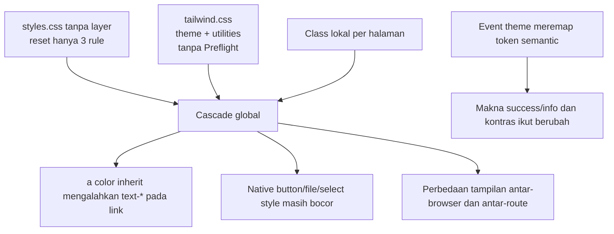
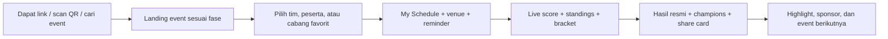
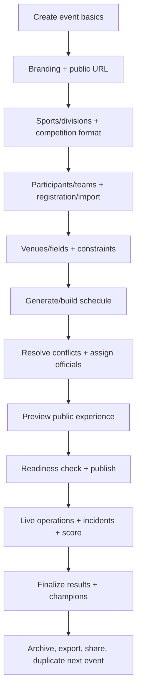

# Audit UI/UX, CSS, dan Visual Standard `roc_gms_v2`

**Tanggal audit:** 2 Agustus 2026  
**Cakupan:** frontend publik, autentikasi, workspace pengelola, form dan wizard, layar operasional pertandingan, Payload Admin, responsive behavior, accessibility, design system, dan pembanding Tournify.  
**Tujuan:** menilai apakah tampilan sudah konsisten dan berstandar, menemukan penyebab elemen yang tampak seperti HTML mentah, serta merancang arah perbaikan agar produk lebih mudah dipahami dan lebih menjual bagi penonton, peserta, dan pengelola turnamen.

> Dokumen ini adalah audit produk dan source code, bukan sertifikasi formal WCAG atau penetration test. Temuan runtime diambil dari aplikasi lokal pada viewport desktop dan mobile, kemudian dicocokkan dengan implementasi React/Next.js, Tailwind, CSS global, dan komponen UI.

---

## 1. Ringkasan eksekutif

### Putusan langsung

`roc_gms_v2` **bukan aplikasi tanpa CSS**. Halaman marketing dan public event sudah memiliki arah visual yang modern: tipografi Plus Jakarta Sans, layout kartu, hero, warna brand, spacing, dan responsive grid bekerja. Akan tetapi, sistem visualnya belum “tertutup”: style bawaan browser masih dapat masuk ke komponen, utility Tailwind tertentu dikalahkan oleh CSS global, dan halaman-halaman berbeda memakai pola kontrol yang tidak seragam.

Contoh pada screenshot upload logo adalah gejala nyata dari masalah fondasi tersebut:

1. `Input` generik dipakai untuk `type="file"` tanpa styling pseudo-element `::file-selector-button`/utility `file:*`.
2. Tailwind Preflight tidak diimpor.
3. Reset global hanya mengatur `box-sizing`, margin body, dan warna link.
4. Akibatnya tombol **Choose File** tetap menggunakan UI bawaan browser/OS, sedangkan kotak luarnya mendapat border dan radius aplikasi.
5. Di halaman lain, upload file justru memiliki utility `file:*`, sehingga satu produk menampilkan beberapa gaya upload yang berbeda.

Masalah yang lebih serius daripada screenshot adalah rule global `a { color: inherit; }` di CSS tanpa layer. Rule ini mempunyai prioritas cascade di atas utility Tailwind yang berada di layer. Hasil runtime membuktikan link CTA yang seharusnya `text-paper`/putih justru mewarisi warna teks gelap. Jadi fondasi CSS saat ini bukan hanya tidak konsisten secara visual, tetapi juga menurunkan kontras dan dapat mengubah maksud desain.

### Penilaian kematangan

| Area | Nilai indikatif | Kesimpulan |
|---|---:|---|
| Identitas visual halaman publik | 7/10 | Sudah memiliki karakter dan hierarki yang cukup kuat |
| Konsistensi antarkomponen | 4/10 | Banyak pola lokal dan kebocoran native browser |
| Fondasi CSS/cascade | 3/10 | Reset tidak lengkap dan ada konflik cascade sistemik |
| Form dan feedback interaksi | 3/10 | Label, error, pending, dan validasi belum menjadi kontrak komponen |
| Accessibility | 3/10 | Banyak asosiasi label, combobox, tabel, dan target sentuh belum memadai |
| Responsive layout | 6/10 | Layout utama adaptif, tetapi kontrol padat dan tabel belum mobile-first |
| Workspace pengelola | 5/10 | Fungsional, tetapi belum sehalus dan sejelas produk SaaS matang |
| Payload Admin/branding | 2/10 | Terlihat seperti produk ketiga dan masih memakai tampilan default |
| Design-system governance | 4/10 | Token dan primitive awal ada, tetapi coverage dan enforcement lemah |
| Visual QA otomatis | 1/10 | Belum ada regression, accessibility, atau browser E2E suite |

### Risiko tertinggi

- **P0 — cascade warna link salah:** CTA dan active navigation dapat memakai warna teks yang tidak sesuai desain dan gagal kontras normal-text.
- **P0 — native control leakage:** button, file input, checkbox/radio tertentu, dan menu custom dapat menampilkan style browser/OS yang berbeda-beda.
- **P0 — aksesibilitas form:** dari audit statis, terdapat 177 penggunaan `Field`, tetapi hanya 2 yang menyertakan `htmlFor`; 94 `Input`, tetapi hanya 2 yang memiliki `id`.
- **P1 — status submit tidak jelas:** tidak ada pola pending/loading/double-submit prevention yang sistematis pada form server action.
- **P1 — tiga bahasa visual:** website publik, custom workspace, dan Payload Admin terasa seperti produk berbeda.
- **P1 — tidak ada visual regression:** perubahan CSS global dapat merusak banyak layar tanpa terdeteksi test yang ada.

---

## 2. Metode dan bukti audit

Audit dilakukan melalui:

1. Pemeriksaan struktur route dan seluruh primitive di `src/components/ui`.
2. Pemeriksaan CSS global, konfigurasi Tailwind, token warna, radius, dan event theme.
3. Penelusuran pola form, tombol, input, file upload, tabel, dialog, card, loading, dan error state.
4. Pemeriksaan runtime pada marketing homepage, login, public event, navigasi mobile, dan Payload Admin.
5. Pengukuran computed style pada elemen yang mencurigakan.
6. Pengujian viewport desktop dan mobile serta horizontal overflow.
7. Pembandingan alur dan surface dengan dokumentasi resmi Tournify.
8. Verifikasi teknis melalui `npm.cmd run typecheck` dan `npm.cmd test`.

Hasil verifikasi teknis saat audit:

- Typecheck: **lulus**.
- Unit test: **lulus**, 2 file dan 25 test.
- Tidak ditemukan script/dependency langsung untuk Playwright E2E, Cypress, Storybook, axe, Lighthouse CI, Chromatic, atau visual regression.

---

## 3. Diagnosis khusus screenshot “Event Logo”

### Yang terlihat

Screenshot memperlihatkan label dan helper text sudah mengikuti tipografi aplikasi, serta outer input memiliki border dan radius. Namun tombol **Choose File** dan teks **No file chosen** masih mengikuti tampilan browser. Ini menciptakan kesan halaman HTML mentah atau CSS tidak selesai.

### Akar masalah source code

Implementasi wizard pada `src/app/(frontend)/workspaces/(focus)/event-admin/new-event/page.tsx` memakai pola berikut:

```tsx
<Input type="file" ... className="cursor-pointer" />
```

Sementara `Input` pada `src/components/ui/input.tsx` adalah primitive umum untuk text input. Primitive ini menata kotak input, tetapi tidak menata tombol selector file. Pada halaman lain justru ditemukan raw input dengan utility `file:*`. Artinya, masalahnya bukan ketidakmampuan Tailwind, melainkan tidak adanya satu komponen upload resmi.

### Mengapa berbeda antar-browser

Tanpa reset dan komponen upload khusus:

- Chrome, Firefox, dan Safari dapat merender selector file secara berbeda.
- Windows dan macOS dapat menunjukkan copy, padding, border, dan tombol yang berbeda.
- Tema high-contrast atau browser default dapat makin menonjolkan perbedaannya.
- Tidak semua bagian native file input dapat distandardisasi dengan class pada elemen induk saja.

### Bentuk perbaikan yang benar

Buat `FileUpload`/`ImageUpload` sebagai komponen tersendiri, bukan sekadar menambahkan class lagi ke `Input` generik. Komponen minimum harus memiliki:

- tombol “Choose image” yang memakai `Button` resmi;
- nama file terpilih;
- batas ukuran, tipe, dan rekomendasi dimensi;
- preview gambar;
- aksi replace/remove;
- validasi client dan server dengan pesan inline;
- loading/progress serta retry;
- focus ring dan label terasosiasi;
- drag-and-drop sebagai peningkatan opsional, bukan satu-satunya cara;
- state kosong, terpilih, invalid, uploading, success, dan failure.

### Acceptance criteria khusus upload

- Seluruh tujuh konteks upload memakai satu keluarga komponen.
- Tampilan selector konsisten di Chrome, Firefox, dan Safari.
- Dapat dioperasikan hanya dengan keyboard.
- Label terbaca screen reader dan error terhubung lewat `aria-describedby`.
- Preview tidak menyebabkan layout shift besar.
- File salah tipe/terlalu besar ditolak sebelum upload dan tetap divalidasi server.
- Tombol replace/remove memiliki target sentuh minimum produk 44×44 px.

---

## 4. Arsitektur CSS saat ini dan sumber inkonsistensi



### Fakta implementasi

- `src/app/(frontend)/layout.tsx` mengimpor `styles.css`, lalu `tailwind.css`.
- `styles.css` hanya berisi tiga baseline: universal `box-sizing`, `body margin: 0`, dan `a color: inherit`.
- `tailwind.css` mengimpor `tailwindcss/theme.css` dan `tailwindcss/utilities.css`, tetapi tidak mengimpor Preflight.
- Komentar source memang menginginkan CSS unlayered selalu mengalahkan Tailwind layer. Efek sampingnya terjadi pada warna link.
- `body` runtime masih memiliki fallback Times New Roman, warna hitam, dan background transparan. Banyak layout anak menambahkan `font-sans`, tetapi elemen yang luput dapat kembali ke default tersebut.

### Konflik cascade yang terbukti di runtime

| Elemen | Class yang dimaksud | Hasil computed style | Dampak |
|---|---|---|---|
| Marketing CTA berupa link | `bg-green text-paper` | background hijau, teks gelap/ink | Kontras turun dan visual tidak sesuai |
| Active public nav link | `text-paper` | teks mewarisi hitam/ink | State aktif kurang jelas |
| Footer/nav link | `text-ink-soft` | dapat mewarisi warna parent | Hirarki warna tidak konsisten |
| Button native di mobile nav | utility ukuran/warna terbatas | font Arial dan background native abu-abu | Terlihat seperti kontrol HTML mentah |
| Login submit `<button>` | Button primitive modern | border `2px outset`, `appearance:auto` | Native border tetap muncul |

### Kesimpulan arsitektur

Harus dipilih satu strategi yang eksplisit:

1. **Direkomendasikan:** aktifkan Tailwind Preflight, lalu tambahkan baseline aplikasi secara terkendali di `@layer base`.
2. Jika Preflight sengaja tidak digunakan, buat reset internal lengkap untuk typography, button, input, select, textarea, media, table, dan form controls; seluruh reset harus berada pada layer yang benar.

Jangan mempertahankan kondisi hibrida sekarang: utility modern di atas baseline native yang tidak dinormalisasi.

---

## 5. Temuan detail — fondasi CSS dan design system

| ID | Prioritas | Temuan | Dampak | Rekomendasi dan acceptance criteria |
|---|---|---|---|---|
| CSS-01 | P0 | `a { color: inherit }` unlayered mengalahkan `text-*` Tailwind pada link. | CTA, nav aktif, dan footer memakai warna salah. | Pindahkan ke `@layer base` atau hapus. Tambahkan regression test untuk Link + setiap variant Button. |
| CSS-02 | P0 | Tailwind Preflight tidak diimpor, sedangkan reset pengganti tidak lengkap. | Style UA bocor ke button, file input, checkbox/radio, dan elemen lain. | Aktifkan Preflight atau bangun reset lengkap; hasil harus sama pada tiga browser utama. |
| CSS-03 | P0 | Button primitive tidak memastikan `appearance-none`, `border-0`, dan pewarisan font. | `<button>` dan `<a>` dengan variant sama tampak berbeda. | Baseline Button wajib identik untuk `button` dan `asChild` link. |
| CSS-04 | P1 | `body` tidak menetapkan font, background, color, line-height, dan antialiasing. | Route/elemen yang luput dari wrapper dapat memakai Times/black/transparan. | Tetapkan baseline body melalui token aplikasi. |
| CSS-05 | P1 | Form elements tidak dipaksa `font: inherit`. | Mobile nav button runtime memakai Arial. | Terapkan pewarisan font pada button/input/select/textarea. |
| CSS-06 | P1 | Token warna belum memisahkan brand dan semantic state. | Warna event dapat mengubah arti sukses/live/info. | Tambahkan token `brand-*`, `success`, `warning`, `danger`, `info` yang independen. |
| CSS-07 | P0 | Event preset meremap token global `green`, `blue`, dan `gold`. | Success/live/status berubah menjadi coral/teal sesuai tema, mengaburkan makna. | Theme hanya mengubah brand surface; semantic state tetap stabil. |
| CSS-08 | P0 | Beberapa kombinasi warna tidak memenuhi 4.5:1 untuk teks normal. | Classic green/white sekitar 4.38:1; actual green/ink sekitar 3.76:1; gold/white sekitar 2.31:1. | Buat contrast contract dan CI test untuk semua pasangan token. |
| CSS-09 | P1 | Preset Sunset/Ocean primer terhadap putih hanya sekitar 3.49/3.44:1. | Teks normal putih di primary berisiko gagal WCAG AA. | Gunakan teks ink pada primary tersebut atau gelapkan primary. |
| CSS-10 | P1 | Border `line` terhadap paper hanya sekitar 1.28:1. | Boundary kontrol/kartu sangat halus jika border adalah satu-satunya indikator. | Perkuat border kontrol interaktif hingga memenuhi non-text contrast yang relevan. |
| CSS-11 | P1 | Warna destructive menggunakan hard-coded `red-*`, bukan token. | Delete/error berbeda antarhalaman dan sulit ditheme. | Tambahkan semantic destructive scale dan variant Button/Alert resmi. |
| CSS-12 | P2 | Bracket tree memakai kumpulan hex gelap terpisah. | Bracket terasa seperti aplikasi berbeda dan sulit mengikuti event theme. | Ubah ke token surface/text/border bracket yang terdokumentasi. |
| CSS-13 | P1 | Token belum mencakup typography scale, shadow, z-index, motion, overlay, disabled, focus, dan surface tiers. | Keputusan visual diulang lokal; konsistensi menurun seiring fitur bertambah. | Dokumentasikan token v1 dan larang magic value baru tanpa alasan. |
| CSS-14 | P2 | Radius tersedia, tetapi pemakaian card/dialog/input belum sepenuhnya dikontrak per komponen. | Terjadi variasi visual kecil yang menumpuk. | Tetapkan radius berdasarkan role, bukan pilihan lokal. |
| CSS-15 | P2 | Motion/transition tidak menghormati `prefers-reduced-motion` secara sistematis. | Pengguna sensitif gerak dapat mengalami animasi yang tidak perlu. | Tambahkan reduced-motion baseline dan uji keyboard/OS setting. |
| CSS-16 | P1 | Focus ring memakai kombinasi transparan yang dapat terlalu halus. | Fokus keyboard kurang terlihat pada surface tertentu. | Tetapkan token focus berkontras dan uji pada paper, mist, primary, serta overlay. |

---

## 6. Temuan detail — primitive, form, dan kontrol

| ID | Prioritas | Temuan | Dampak | Rekomendasi dan acceptance criteria |
|---|---|---|---|---|
| FORM-01 | P0 | Tidak ada shared `FileUpload`; tujuh konteks memakai pola berbeda. | Screenshot raw, state dan validasi berbeda antarlayar. | Satukan ke `FileUpload`/`ImageUpload`; migrasikan semua pemakaian. |
| FORM-02 | P0 | 177 penggunaan `Field`, hanya 2 menyertakan `htmlFor`. | Mayoritas label visual tidak terhubung ke control. | `FormField` harus menghasilkan ID otomatis dan selalu mengikat label-control. |
| FORM-03 | P0 | 94 penggunaan `Input`, hanya 2 memiliki `id`. | Klik label tidak memfokuskan input; screen reader kehilangan nama. | ID generated/required di primitive; lint/test memastikan asosiasi. |
| FORM-04 | P1 | `Field` hanya memiliki label dan child, tanpa slot hint/error/required/state. | Copy bantuan dan error tidak konsisten. | Tambahkan description, error, optional/required marker, dan `aria-describedby`. |
| FORM-05 | P1 | Error server umumnya ditampilkan sebagai banner halaman, bukan pada field. | Pengguna harus menebak input mana yang salah. | Map server validation ke field dan fokuskan error pertama. |
| FORM-06 | P1 | Tidak ada kontrak `aria-invalid` dan error announcement. | Error sulit dideteksi pengguna assistive technology. | Error field memakai `aria-invalid=true`, ID pesan, dan summary alert. |
| FORM-07 | P1 | Dari 55 form, tidak ditemukan pola pending dengan `useFormStatus`/`useActionState`. | Tidak ada feedback konsisten saat submit dan rawan submit ganda. | Buat `SubmitButton` dengan pending label, spinner, disabled, dan idempotensi server. |
| FORM-08 | P1 | 110 penggunaan Button, hanya 51 menyatakan `type`; primitive tidak memaksa default aman. | Button non-submit di dalam form dapat mengirim form tanpa sengaja. | Default Button `type="button"`; SubmitButton eksplisit. Validasi semua pemakaian. |
| FORM-09 | P1 | Button hanya memiliki primary, secondary, ghost dan dua ukuran. | Delete, icon, link, large CTA, loading dibuat ad hoc. | Tambah destructive, link, icon, lg, loading beserta matriks state. |
| FORM-10 | P1 | SearchableSelect adalah combobox custom tanpa semantic combobox/listbox. | Tidak dapat dipakai dengan baik oleh keyboard dan screen reader. | Gunakan primitive accessible atau implementasi penuh ARIA combobox. |
| FORM-11 | P1 | SearchableSelect tidak mendukung ArrowUp/Down, Home/End, active descendant, dan announcement. | Navigasi opsi bergantung mouse/tab yang melelahkan. | Lengkapi keyboard model dan test E2E. |
| FORM-12 | P1 | Opsi SearchableSelect berupa native buttons tanpa reset lengkap. | Style browser dapat bocor ke dropdown. | Gunakan primitive menu/command yang distandardisasi. |
| FORM-13 | P2 | Dropdown absolute tidak memakai portal/collision handling. | Daftar dapat terpotong oleh overflow atau keluar viewport. | Gunakan popover portal dan collision-aware positioning. |
| FORM-14 | P2 | Required pada SearchableSelect didefer ke server. | Feedback terlambat dan tidak dekat control. | Tambah client validation yang sejalan dengan server. |
| FORM-15 | P1 | Date/time mengandalkan native control tanpa timezone/konteks event yang jelas. | Jadwal dapat dimasukkan dalam zona waktu yang salah. | Tampilkan timezone event, preview absolut, dan validasi urutan waktu. |
| FORM-16 | P1 | Checkbox/radio belum mempunyai primitive bersama. | Ukuran, warna, label, focus, dan disabled state berbeda. | Buat Checkbox dan RadioGroup dengan target sentuh 44 px melalui label wrapper. |
| FORM-17 | P2 | Tidak ada input group/prefix/suffix dan password toggle. | Slug, URL, angka, dan password kurang informatif. | Tambah InputGroup serta pola show/hide password. |
| FORM-18 | P2 | Tidak ada konfirmasi unsaved changes pada dialog/form besar. | Admin dapat kehilangan input panjang. | Tambah dirty-state guard untuk close, navigation, dan event switch. |
| FORM-19 | P2 | Success message banyak bergantung query param. | Reload/back dapat mengulang atau menghilangkan feedback; flow terasa mekanis. | Gunakan toast/status region ditambah state halaman yang tahan navigasi. |
| FORM-20 | P1 | AlertBanner tidak otomatis mempunyai role `alert`/`status`. | Pesan async mungkin tidak diumumkan. | Tone error -> alert; success/info -> status, dengan override bila perlu. |

---

## 7. Temuan detail — accessibility dan semantik

| ID | Prioritas | Temuan | Dampak | Rekomendasi dan acceptance criteria |
|---|---|---|---|---|
| A11Y-01 | P0 | Asosiasi label-control mayoritas tidak ada. | Hambatan utama bagi screen reader dan pengguna motorik. | Selesaikan migrasi FormField sebelum menambah form baru. |
| A11Y-02 | P1 | Tidak ada skip link ke main content. | Pengguna keyboard harus melewati navigasi di setiap halaman. | Tambah skip link yang muncul saat fokus. |
| A11Y-03 | P1 | Target sentuh banyak di bawah standar internal 44×44. | Link nav, footer, back link, dan aksi tabel sulit disentuh. | Perbesar hit area tanpa harus memperbesar visual icon. |
| A11Y-04 | Catatan | WCAG 2.2 AA Target Size Minimum adalah 24×24 atau memiliki spacing exception; 44×44 adalah enhanced/AAA dan praktik produk yang baik. | Menghindari klaim audit yang salah. | Gunakan 44×44 sebagai standar internal, laporkan pengecualian AA secara akurat. |
| A11Y-05 | P1 | Active nav yang seharusnya putih menjadi hitam karena cascade. | State aktif dan kontras memburuk. | Perbaiki cascade, lalu snapshot tiap state. |
| A11Y-06 | P1 | Tabel tidak memiliki caption/scope secara konsisten. | Relasi header dan data kurang jelas bagi screen reader. | Primitive Table menyediakan caption, `scope`, dan action-header label. |
| A11Y-07 | P1 | Header kolom action sering kosong. | Pengguna tidak tahu fungsi kolom. | Beri label visual tersembunyi “Actions”. |
| A11Y-08 | P1 | Card `interactive` tetap berupa `<div>` dan tidak focusable. | Focus-visible class tidak pernah aktif pada card itu sendiri. | Buat LinkCard/ButtonCard dengan elemen semantic atau dukungan `asChild`. |
| A11Y-09 | P1 | Cursor pointer diterapkan pada beberapa card yang bukan satu aksi utuh. | Affordance menipu pengguna. | Cursor interaktif hanya pada elemen yang benar-benar dapat diaktivasi. |
| A11Y-10 | P1 | Dialog mematikan `aria-describedby` dan tidak menyediakan description slot konsisten. | Tujuan dialog kurang jelas bagi screen reader. | DialogContent menerima description dan mengikatnya otomatis. |
| A11Y-11 | P1 | Tombol close dialog 36×36; mobile nav 40×40. | Di bawah standar internal produk 44 px. | Besarkan hit area menjadi minimum 44×44. |
| A11Y-12 | P1 | Heading public event memiliki pola `h2`/`h3`, lalu panel nested kembali ke `h2`. | Struktur outline tidak mewakili hubungan konten. | Audit heading per template dan gunakan level berdasarkan konteks. |
| A11Y-13 | P1 | Skeleton tidak memiliki `aria-busy`/status loading. | Pengguna screen reader tidak mendapat konteks perubahan. | Container async memakai `aria-busy`, nama region, dan status singkat. |
| A11Y-14 | P2 | Tidak ada strategi live region untuk update score/refresh. | Perubahan skor dapat terjadi tanpa diketahui. | Umumkan perubahan penting secara ringkas; jangan membacakan seluruh tabel. |
| A11Y-15 | P2 | State status memakai warna yang semantic mapping-nya dapat berubah. | Pengguna color-vision deficiency sulit mengenali status. | Selalu gabungkan teks/icon/shape dan semantic color stabil. |
| A11Y-16 | P2 | `html lang="en"` sesuai copy saat ini, tetapi tidak ada locale strategy untuk audiens Indonesia/multibahasa. | Pelafalan screen reader dan format tanggal dapat salah jika copy dicampur. | Tentukan bahasa produk/event dan set locale secara konsisten. |
| A11Y-17 | P2 | Focus style link tidak dikontrak pada semua surface. | Beberapa link hanya mengandalkan outline native. | Buat focus treatment global yang tidak menghapus native sebelum pengganti siap. |
| A11Y-18 | P2 | Tidak ditemukan automated axe/keyboard audit. | Regresi aksesibilitas tidak tertangkap. | Tambah axe pada template utama dan keyboard journey pada E2E. |

Rujukan standar: [WCAG 2.2](https://www.w3.org/TR/WCAG22/), [Understanding Target Size (Minimum)](https://www.w3.org/WAI/WCAG22/Understanding/target-size-minimum), dan [Understanding Focus Appearance](https://www.w3.org/WAI/WCAG22/Understanding/focus-appearance.html).

---

## 8. Temuan detail — halaman publik dan pengalaman peserta/penonton

| ID | Prioritas | Temuan | Dampak | Rekomendasi dan acceptance criteria |
|---|---|---|---|---|
| PUB-01 | P1 | Homepage tidak menyediakan discovery/search event. | Penonton harus mengetahui slug/link langsung. | Tambah event search/directory bila model bisnis memang publik; jika private, jelaskan mekanisme link/QR. |
| PUB-02 | P1 | CTA “explore every step before account” berujung login. | Janji dan hasil klik tidak cocok; trust menurun. | Sediakan demo/read-only sandbox atau ubah copy CTA secara jujur. |
| PUB-03 | P2 | Homepage mobile sangat panjang, sekitar 4.365 px pada audit. | Nilai produk dan CTA akhir membutuhkan scroll panjang. | Ringkas repetisi, tambahkan sticky minimal CTA, proof, demo, dan anchor. |
| PUB-04 | P1 | CTA link memakai teks gelap di hijau akibat cascade; kontras sekitar 3.76:1. | CTA paling penting gagal terlihat sebagaimana desain. | Perbaiki cascade dan gunakan pasangan warna yang lulus kontrak. |
| PUB-05 | P2 | Copy “Hosting your Tournament’s” memakai apostrof yang salah dan muncul berulang. | Menurunkan kesan profesional. | Ubah menjadi copy grammatically correct dan lakukan content QA. |
| PUB-06 | P1 | Event page kuat secara naratif, tetapi primary nav hanya Home, Sports, Updates, Schedule. | Standings, Champions, dan bracket kurang mudah ditemukan. | Tampilkan menu adaptif atau “More”; berdasarkan tipe event, prioritaskan Schedule/Standings/Bracket. |
| PUB-07 | P1 | Tidak ada participant lens “My Team/My Schedule”. | Peserta harus menyaring seluruh jadwal berulang kali. | Tambah favorite team/participant dan halaman personal tanpa wajib login. |
| PUB-08 | P1 | Tidak ada share/QR surface yang menonjol. | Organizer sulit mendistribusikan event; penonton sulit kembali. | Buat Share Event dengan QR, copy link, native share, dan printable poster. |
| PUB-09 | P2 | Standings/result belum memiliki share-card/download flow sekelas benchmark. | Konten prestasi kurang viral dan kurang menjual. | Generate image share card dan branded export. |
| PUB-10 | P1 | Sponsor/partner belum menjadi bagian appearance/public design. | Peluang komersial event hilang. | Tambah sponsor tiers, placement, link, logo validation, dan reporting. |
| PUB-11 | P2 | Format tanggal memakai locale English secara hard-coded. | Tidak sesuai event lokal dan sulit diinternasionalisasi. | Locale mengikuti event, dengan timezone terlihat. |
| PUB-12 | P1 | Link kecil seperti “Full schedule”, category link, footer, dan back link mempunyai hit area sempit. | Sulit disentuh di ponsel. | Gunakan inline-link hit-area/padding pattern tanpa merusak layout. |
| PUB-13 | P2 | Event hero kaya informasi, tetapi hierarchy dapat terlalu padat ketika countdown/live/content muncul bersama. | Penonton sulit menentukan aksi pertama. | Tetapkan satu primary action berdasarkan fase: pre-event, live, selesai. |
| PUB-14 | P1 | Fase event belum secara eksplisit mengubah IA dan CTA. | Homepage pra-event/live/post-event terasa sama. | Buat phase-aware shell: register/prepare, live now, results/highlights. |
| PUB-15 | P2 | Article/detail media memakai raw `` dan strategi ukuran/loading belum konsisten. | Potensi layout shift dan bandwidth berlebih. | Tetapkan aspect ratio, width/height, responsive source, lazy/eager policy. |
| PUB-16 | P2 | Auto-refresh/freshness ada pada sebagian data, tetapi timestamp/stale state belum seragam. | Penonton tidak tahu apakah skor terkini. | Tampilkan “updated X sec ago”, reconnecting, stale, dan retry. |
| PUB-17 | P2 | Tidak ada mode display/slideshow khusus venue. | Score/schedule di TV harus memakai halaman web umum. | Tambah fullscreen display dengan auto-rotate, theme, dan kontrol page. |
| PUB-18 | P2 | Tidak terlihat opsi add-to-calendar pada jadwal pribadi. | Peserta mengandalkan screenshot/manual reminder. | Tambah ICS/add-to-calendar dari match/team schedule. |

### Alur publik yang disarankan



Setiap langkah harus menjawab satu pertanyaan pengguna:

- “Saya berada di event yang benar?”
- “Kapan dan di mana saya bermain/menonton?”
- “Apa yang sedang live?”
- “Siapa yang lolos/menang?”
- “Bagaimana membagikan atau kembali ke halaman ini?”

---

## 9. Temuan detail — workspace dan pengalaman admin turnamen

| ID | Prioritas | Temuan | Dampak | Rekomendasi dan acceptance criteria |
|---|---|---|---|---|
| ADM-01 | P1 | Wizard mencampur input modern dengan native file control. | First impression onboarding terasa belum selesai. | Jadikan seluruh step memakai component contract yang sama. |
| ADM-02 | P1 | Wizard panjang belum mempunyai validation summary dan status lengkap per step. | Admin baru sulit tahu bagian yang belum siap. | Step state: not started, in progress, complete, warning, blocked. |
| ADM-03 | P1 | Preview public site tidak menjadi loop utama setiap perubahan. | Admin sulit percaya hasil akhirnya. | Sediakan live preview desktop/mobile dan deep link “View public page”. |
| ADM-04 | P1 | Appearance hanya mengatur hero dan tiga preset. | Branding event terlalu terbatas untuk kebutuhan komersial. | Tambah logo management, brand color dengan contrast guard, sponsor, background, dan social image. |
| ADM-05 | P1 | Copy wizard mengatakan logo dapat ditambah/diubah kemudian, tetapi halaman Appearance saat ini hanya memiliki hero image dan color theme. | Janji UI tidak memiliki jalur lanjut yang jelas. | Tambah pengelolaan logo di Appearance/Details atau perbaiki copy dan navigasinya. |
| ADM-06 | P1 | Preset hanya menampilkan swatch, bukan simulasi komponen nyata. | Admin tidak melihat dampak tema terhadap teks/status/CTA. | Preview button, link, status, table, hero, serta warning kontras sebelum save. |
| ADM-07 | P1 | Scheduler kaya data, tetapi tabel/drag-drop belum memiliki mobile alternative dan keyboard model terstandar. | Sulit mengelola di tablet/keyboard. | Sediakan agenda/card mode, keyboard move, konflik terlihat, dan undo. |
| ADM-08 | P1 | Search/filter/sort/pagination DataTable tidak distandardisasi. | Tiap modul admin terasa berbeda dan tidak scalable. | Buat DataTable + toolbar + saved filters + bulk selection. |
| ADM-09 | P1 | Action column dan small icon actions kurang jelas. | Risiko salah klik edit/delete. | Label/tooltip, target 44 px, destructive confirmation dengan objek yang disebutkan. |
| ADM-10 | P1 | Tidak ada standardized loading/error/retry route state. | Operasi lambat terlihat hang atau halaman kosong. | Tambah `loading.tsx`, `error.tsx`, `not-found.tsx`, retry, dan skeleton kontekstual. |
| ADM-11 | P1 | Audit runtime mengalami satu navigasi schedule yang timeout setelah 20 detik. | Ada indikasi cold/data path yang perlu diprofilkan, walau belum cukup untuk menyatakan bug deterministik. | Instrument server timing, query count, cache, dan p95 route transition. |
| ADM-12 | P1 | Tidak ada optimistic feedback/undo untuk operasi aman. | CRUD terasa lambat dan kaku. | Gunakan optimistic state untuk reorder/toggle; undo untuk aksi reversible. |
| ADM-13 | P1 | Delete/destructive style dibuat lokal. | Hierarki risiko tidak konsisten. | ConfirmDialog resmi, destructive token, copy konsekuensi, dan typed confirmation untuk aksi besar. |
| ADM-14 | P2 | Switch active event berpotensi kehilangan konteks form. | Admin dapat mengedit event yang salah atau kehilangan perubahan. | Persistent event identity, dirty guard, dan scope banner pada semua halaman. |
| ADM-15 | P1 | Tidak ada readiness checklist sebelum publish/live. | Event dapat dipublikasikan dengan jadwal/venue/participant belum siap. | Preflight checker dengan blocker/warning dan link langsung ke perbaikan. |
| ADM-16 | P1 | Tidak ada explicit publish lifecycle yang productized. | Admin sulit memahami draft, preview, published, live, archived. | Tambah state machine, timestamp, role permission, dan audit log. |
| ADM-17 | P2 | Bulk import ada, tetapi UX mapping, preview, error row, dan download-error harus dikontrak. | Admin harus memperbaiki file dengan trial-and-error. | Import wizard: upload, map, validate, preview diff, commit, result. |
| ADM-18 | P1 | Permission/role error berpotensi menjadi dead end. | User tidak tahu siapa yang dapat memberi akses. | Tampilkan role dibutuhkan, current role, event scope, dan contact/request path. |
| ADM-19 | P2 | Konten, media, event data, dan match operations memakai pola form/upload yang berbeda. | Learning curve admin meningkat. | Satukan PageHeader, FormField, FileUpload, DataTable, Dialog, dan FormActions. |
| ADM-20 | P2 | Tidak ada contextual help yang terhubung dengan tugas saat ini. | Organizer pemula harus menebak istilah kompetisi. | Tambah helper, example, dan “why this matters” pada setting kompleks. |

### Alur admin yang disarankan



Dashboard admin sebaiknya berfungsi sebagai **next-best-action console**, bukan kumpulan kartu menu. Contoh: “12 teams belum masuk group”, “3 pertandingan bentrok venue”, “public page belum memiliki logo”, “jadwal siap dipublikasikan”.

---

## 10. Temuan detail — tabel, dialog, media, responsive, dan state

| ID | Prioritas | Temuan | Dampak | Rekomendasi dan acceptance criteria |
|---|---|---|---|---|
| UI-01 | P1 | Table wrapper hanya mengandalkan horizontal scroll. | Pengguna mobile tidak mendapat indikasi ada kolom tersembunyi. | Tambah edge fade/scroll hint, sticky first column, atau card view. |
| UI-02 | P1 | Tidak ada responsive priority per kolom. | Semua data dianggap sama penting pada layar kecil. | Definisikan primary, secondary, expandable, dan action columns. |
| UI-03 | P2 | Row hover ada, tetapi selected/focus state tidak dikontrak. | Keyboard dan bulk action tidak jelas. | Tambah row focus, selected, disabled, conflict, dan live states. |
| UI-04 | P1 | Direct Radix dialogs menduplikasi style shared Dialog. | Fix accessibility/style tidak otomatis menyebar. | Migrasikan semua dialog ke primitive resmi. |
| UI-05 | P1 | Dialog form tidak memiliki sticky action footer pada mobile. | Tombol save hilang di bawah form panjang. | Gunakan FormActions sticky dengan safe-area inset. |
| UI-06 | P2 | Dialog belum memiliki full-screen mobile policy. | Konten sempit/panjang sulit digunakan. | Breakpoint policy: sheet/fullscreen untuk form kompleks. |
| UI-07 | P2 | Raw `` tersebar karena URL Payload dinamis. | Optimisasi, CLS, dan policy alt tidak seragam. | Buat Media component untuk Payload URL dengan dimension metadata. |
| UI-08 | P2 | Upload media tidak menampilkan progress/retry konsisten. | Pengguna menganggap aplikasi hang pada file besar. | Tampilkan progress per file, cancel, retry, dan partial failure. |
| UI-09 | P1 | Tidak ada frontend `loading.tsx`, `error.tsx`, `not-found.tsx`, atau `global-error.tsx` yang memadai pada route group. | State framework default/blank dapat muncul. | Desain route-level states per shell. |
| UI-10 | P1 | Payload `/admin` sempat blank sebelum redirect client ke login pada audit. | First load terlihat rusak atau lambat. | Gunakan redirect server atau branded loading shell. |
| UI-11 | P2 | EmptyState ada, tetapi tidak ada kontrak untuk empty-search, empty-first-use, filtered-empty, dan permission-empty. | Pesan dan CTA tidak selalu membantu. | Definisikan empat empty-state variants. |
| UI-12 | P1 | Tidak ada offline/reconnecting/stale state konsisten untuk live event. | Live score dapat terlihat valid padahal koneksi terputus. | Connection banner, last update, retry/backoff, dan stale visual treatment. |
| UI-13 | P2 | Mobile menu control raw 40×40 dan style UA. | Navigasi pertama di mobile terlihat belum dipoles. | Gunakan IconButton resmi 44×44 dengan accessible name. |
| UI-14 | P2 | Navbar/footer link hit area bergantung ukuran teks. | Sulit disentuh dan tidak konsisten. | Kontrak `NavLink` dengan padding/hit target. |
| UI-15 | P2 | Tidak ada content-density switch pada layar operasional. | Operator membutuhkan data padat, admin biasa membutuhkan keterbacaan. | Comfortable/compact density dengan minimum targets tetap dijaga. |
| UI-16 | P2 | Safe-area untuk perangkat ber-notch/bottom bar belum menjadi token/pola. | Sticky action dapat tertutup browser chrome. | Gunakan `env(safe-area-inset-*)`. |

---

## 11. Audit per surface

### 11.1 Marketing homepage

**Yang sudah baik**

- Hero, statistik, feature sections, dan CTA memiliki visual hierarchy yang jelas.
- Responsive grid bekerja dan tidak ditemukan horizontal overflow pada viewport 390 px.
- Plus Jakarta Sans dan palette memberi identitas yang lebih kuat daripada admin default.

**Celah**

- CTA color rusak karena cascade link.
- Copy demo/login tidak selaras.
- Halaman mobile panjang dan belum memiliki proof yang kuat seperti testimonial, event logos, atau demo nyata.
- Tidak ada discovery event atau penjelasan tegas bagaimana penonton menemukan event.
- Target klik nav/footer kecil.

### 11.2 Login

**Yang sudah baik**

- Ini salah satu form yang benar-benar menghubungkan label Email/Password dengan input.
- Tinggi input dan submit sekitar 44 px.
- Struktur visual relatif rapi.

**Celah**

- Native `2px outset` border terbukti masih melekat pada `<button>`.
- Belum ada show password, pending submit, inline error, dan clear recovery path yang seragam.
- Branding/copy masih perlu content QA.

### 11.3 Public event home

**Yang sudah baik**

- Hero event, countdown, Live Now/Next Up, upcoming dates, sports, standings, updates, dan organizer info membentuk landing event yang kaya.
- Surface ini lebih “menjual” daripada halaman tabel semata.

**Celah**

- Primary nav kurang mengekspos standings/bracket/champions.
- State active link salah warna.
- Heading nested tidak selalu konsisten.
- Konten terpenting belum berubah secara eksplisit berdasarkan fase event.
- Tidak ada My Team/My Schedule, share/QR, calendar, atau notification preference.

### 11.4 Sports/category dan match detail

- Category card perlu memastikan seluruh kartu benar-benar link atau hanya bagian CTA yang pointer.
- Match detail harus memprioritaskan status resmi, waktu/timezone, venue/map, peserta, score timeline, dan sumber update.
- Live/offline/stale/correction state harus terlihat; skor yang direvisi perlu audit trail publik bila relevan.
- Related schedule perlu personal filter dan action add-to-calendar.

### 11.5 Schedule, standings, champions, bracket

- Navigasi di bawah Schedule membuat fitur penting kurang discoverable.
- Tabel perlu caption, scope, responsive column priority, share, print, dan export.
- Bracket memakai visual language gelap terpisah; perlu tokenisasi dan aksesibilitas zoom/pan.
- Standings perlu legend tiebreaker dan penjelasan qualification.
- Champions sebaiknya menjadi post-event share surface, bukan hanya list.

### 11.6 Updates/articles

- Struktur konten sudah memberi kanal berita event.
- Perlu policy image ratio/size, author/date/updated status, related updates, share action, dan readable line length.
- Heading hierarchy antara section dan panel perlu diperbaiki.

### 11.7 New-event wizard

- Screenshot merupakan representasi tepat inkonsistensi wizard.
- Semua field harus memakai FormField resmi; bukan label visual tanpa asosiasi.
- Stepper perlu completion/error state dan summary akhir dengan edit shortcut.
- File logo, import Excel, dan upload lain harus memakai satu upload family.
- Draft autosave/recovery dan validation summary akan sangat mengurangi rasa takut admin baru.

### 11.8 Event details dan Appearance

- Appearance saat ini mengelola hero image dan tiga preset warna.
- Belum cukup sebagai brand center: logo lifecycle, sponsor, social card, custom color guard, favicon, dan preview perangkat belum terlihat.
- Terdapat kontradiksi copy: wizard mengatakan logo dapat diubah kemudian, tetapi Appearance tidak menyediakan field logo.
- Radio preset secara visual cukup baik, tetapi perlu preview komponen dan contrast warning.

### 11.9 Participants, entries, clubs, facilities

- Data-heavy modules membutuhkan DataTable standard, bulk actions, import preview, merge/duplicate detection, dan filter tersimpan.
- Delete harus menyebut dependency: menghapus participant/team dapat memengaruhi entry, match, standings, dan schedule.
- Facility membutuhkan capacity/resource/availability conflict, bukan hanya CRUD nama.

### 11.10 Scheduler

- Scheduler adalah core differentiator, tetapi harus mempunyai constraint conflict panel, undo, keyboard move, autosave status, dan publish version.
- Desktop dense grid boleh dipertahankan untuk power user, namun tablet perlu agenda/card mode.
- Export PDF/Excel dan printable venue schedule penting untuk operasi lapangan.

### 11.11 Match officer/live score

- UI harus “glanceable”: current match, participant, score, period, timer, last saved, connection, dan next action.
- Aksi skor perlu large targets, undo/correction, confirmation pada finalize, dan audit log.
- Destructive or irreversible transitions tidak boleh hanya dibedakan warna.
- Perlu mode low-connectivity dan recovery dari refresh/tab close.

### 11.12 Content admin/media

- Form artikel dan media memakai upload style berbeda dari wizard.
- Rich content perlu preview publik, draft/publish status, validation, alt text enforcement, dan image focal point.
- Media library perlu duplicate detection, usage references, size/dimension, bulk selection, dan safe delete warning.

### 11.13 Payload Admin

- `src/app/(payload)/custom.scss` praktis kosong; layar login menggunakan default Payload dark theme dan logo Payload.
- Ini menciptakan bahasa visual ketiga setelah public site dan custom workspace.
- Kontrol login Payload sekitar 40 px; target internal 44 px belum tercapai.
- Payload sebaiknya diposisikan sebagai **internal super-admin/CMS technical console**, bukan jalur utama organizer.
- Jika tetap diakses pengguna eksternal, branding, navigation model, terminology, role guard, support link, loading, dan error page harus disamakan.

---

## 12. Perbandingan dengan Tournify

Rujukan yang diperiksa:

- [Getting started with Tournify](https://help.tournifyapp.com/en/articles/15069302-getting-started-with-tournify)
- [Create a tournament website](https://help.tournifyapp.com/en/articles/9071602-create-a-tournament-website)
- [Schedule](https://help.tournifyapp.com/en/articles/8909552-schedule)
- [Participants](https://help.tournifyapp.com/en/articles/8909540-participants)
- [Customize the design](https://help.tournifyapp.com/en/articles/9127962-customize-the-design)
- [Present](https://help.tournifyapp.com/en/articles/8954107-present)
- [Share standings and rankings](https://help.tournifyapp.com/en/articles/14755815-share-group-standings-and-rankings-on-social-media)

### Perbandingan produk

| Dimensi | `roc_gms_v2` saat ini | Tournify menurut dokumentasi | Peluang ROC |
|---|---|---|---|
| Public event landing | Lebih naratif dan kaya hero/content | Website publik menjadi hub data turnamen | Pertahankan kekuatan storytelling ROC |
| Pemisahan public/admin | Public + custom workspace + Payload Admin | Public Tournify + `manage.tournifyapp.com` yang jelas | Jadikan custom workspace satu-satunya organizer UI; Payload internal |
| Navigasi publik | Home, Sports, Updates, Schedule; standings nested | Default Info, My Team, Standings, Schedule | Tambah participant lens dan surface utama yang mudah ditemukan |
| Website publishing | Ada public slug/page, lifecycle belum productized | Aktivasi public site, page selection, URL, QR | Tambah publish center, configurable pages, QR, preview |
| Branding | Hero dan tiga preset; logo dibuat saat wizard | Primary color, logo, background, sponsor, logo per entity | Bangun brand center dan sponsor inventory |
| Participant registration | Import/management tersedia; public registration belum kuat | Built-in registration page dan player-per-team support | Tambah registration funnel dan approval/payment bila scope bisnis membutuhkan |
| Scheduling | Fitur internal cukup luas | Planner, filter, drag-drop, break/event, referee, multi-day/location, export | Fokus pada conflict UX, assignment, export, version/publish |
| Presentation venue | Public page umum | Slideshow untuk TV/projector dan page selection | Tambah display mode untuk venue |
| Sharing | Belum productized | Share/download standings, rankings, player stats | Tambah branded share cards dan social metadata |
| Notification | Belum terlihat sebagai end-to-end surface | App dan push notifications disebut dalam public experience | Mulai dari favorite team + email/web notification preference |
| Export | Belum konsisten per surface | Schedule PDF/Excel | Jadikan export bagian dari action model DataTable/scheduler |
| Mobile participant flow | Responsive, tetapi tidak personal | My Team dan app mendekatkan data pengguna | Tambah My Schedule tanpa memaksa akun |

### Yang tidak perlu disalin mentah dari Tournify

- ROC sudah memiliki landing event yang lebih emosional dan cocok untuk selling/branding; jangan mengubahnya menjadi dashboard tabel murni.
- Tidak semua event memerlukan native mobile app. PWA/favorite team/shareable link dapat menjadi tahap pertama yang lebih murah.
- Configurability jangan membuat setup awal terlalu kompleks. Gunakan preset dan progressive disclosure.

### Prinsip yang sebaiknya diadopsi

1. Pemisahan tegas antara pengalaman publik dan `manage`.
2. Public site sebagai output utama yang dapat dipreview, dikonfigurasi, dan dibagikan via QR.
3. “My Team/My Schedule” sebagai shortcut bagi peserta.
4. Scheduling sebagai workflow, bukan sekadar tabel CRUD.
5. Sponsor, presentation mode, export, dan share card sebagai fitur monetisasi/distribusi.

---

## 13. Komponen yang perlu dibangun atau diperbaiki

### Foundation

- `AppBaseline`/base CSS layer
- semantic color tokens dan contrast tests
- typography scale
- focus, disabled, overlay, z-index, shadow, motion tokens
- responsive spacing/container tokens

### Form

- `FormField`
- `FormDescription`
- `FormError`
- `InputGroup`
- `FileUpload` dan `ImageUpload`
- `Checkbox`
- `RadioGroup`
- `Switch`
- accessible `Combobox`
- `DateTimeField` + timezone
- `SubmitButton`/`LoadingButton`
- `FormActions`
- `ValidationSummary`

### Navigation dan feedback

- `NavLink`
- `IconButton`
- `Breadcrumb`
- `Tabs`
- `DropdownMenu`
- `Tooltip`
- `Toast` + live region
- `Progress`/complete Stepper
- `ConnectionStatus`

### Data/admin

- `PageHeader` dan `SectionHeader`
- `DataTable`
- `DataTableToolbar`
- `Pagination`
- bulk action bar
- filter chips/saved views
- responsive row/card detail
- `ConfirmDialog`
- conflict panel
- audit log/timeline

### Public/event

- `ShareEvent` + QR
- `FavoriteTeam`/`MySchedule`
- phase-aware event hero
- sponsor strip/grid
- share card generator
- fullscreen presentation mode
- add-to-calendar

---

## 14. Roadmap prioritas

### P0 — hentikan kebocoran visual dan masalah aksesibilitas dasar (1–3 hari fokus)

1. Perbaiki cascade `a { color: inherit }`.
2. Pilih dan implementasikan strategi Preflight/reset.
3. Normalisasi Button, IconButton, font inheritance, appearance, dan border.
4. Tetapkan baseline body.
5. Koreksi pasangan warna CTA/status yang gagal kontras.
6. Buat minimum viable `FormField` dengan ID/label/error otomatis.
7. Buat minimum viable `FileUpload`; migrasikan screenshot logo dan appearance hero terlebih dahulu.
8. Tambah smoke screenshots untuk homepage, login, wizard, public event, dan workspace.

### P1 — satu sampai dua sprint

1. Migrasikan seluruh form ke FormField dan SubmitButton pending state.
2. Ganti SearchableSelect dengan combobox accessible.
3. Satukan dialog dan destructive confirmation.
4. Tambah route loading/error/not-found dan connection freshness.
5. Bangun DataTable responsive + toolbar.
6. Perbaiki public navigation, target sentuh, heading hierarchy, dan phase-aware CTA.
7. Jadikan Appearance sebagai brand center, termasuk logo, preview, contrast guard, dan sponsor dasar.
8. Tegaskan Payload sebagai internal super-admin; server redirect dan minimal branding.
9. Tambah Playwright E2E + axe + visual snapshot untuk critical journey.

### P2 — diferensiasi dan daya jual

1. My Team/My Schedule dan favorite participant.
2. Share event, QR, branded standings/champion cards.
3. Add-to-calendar dan notification preferences.
4. Venue display/slideshow mode.
5. Sponsor placement dan analytics.
6. Schedule export PDF/Excel serta printable venue/referee sheets.
7. Publish readiness, version, audit log, archive, dan duplicate event.

---

## 15. Acceptance criteria lintas produk

Perbaikan UI dianggap selesai hanya bila:

- Tidak ada native UA button border/background/font yang tidak disengaja.
- Variant Button tampak identik saat dirender sebagai `<button>` maupun `<a>`.
- Semua input mempunyai accessible name; semua error terhubung ke control.
- Semua form async menunjukkan pending, mencegah submit ganda, dan mengumumkan hasil.
- Semua warna teks normal lulus 4.5:1; large text 3:1; boundary/focus penting diuji sesuai kriterianya.
- Interaksi utama dapat diselesaikan dengan keyboard saja.
- Target sentuh internal 44×44 dipenuhi atau pengecualiannya terdokumentasi.
- Tidak ada horizontal page overflow pada 360 px; tabel mempunyai strategi responsif eksplisit.
- Page states mencakup loading, empty, filtered-empty, error, permission, offline/stale, dan success.
- Event theme tidak mengubah semantic success/warning/danger.
- Public preview identik dengan hasil publish untuk data dan tema yang sama.
- Critical pages memiliki visual snapshot dan axe checks pada CI.
- Payload Admin tidak muncul sebagai jalur organizer umum.

---

## 16. Matriks visual QA yang direkomendasikan

### Viewport

- 360×800 — mobile kecil
- 390×844 — mobile umum
- 768×1024 — tablet portrait
- 1024×768 — tablet landscape/operator
- 1280×720 — laptop pendek
- 1440×900 — desktop
- 200% zoom pada desktop

### Browser dan preference

- Chrome/Chromium
- Firefox
- Safari/WebKit
- keyboard-only
- reduced motion
- dark/high-contrast OS bila didukung
- slow 3G/offline/reconnect untuk live score dan upload

### Snapshot wajib

- marketing home dan mobile menu
- login: idle, invalid, pending, success/error
- new event: setiap step, logo selected/error, import error
- public event: pre-event, live, finished
- schedule/standings/bracket di desktop dan mobile
- workspace list/table/dialog/form
- scheduler konflik dan empty state
- live score connected/stale/offline/finalize
- appearance preview tiap preset
- Payload login/loading/unauthorized

---

## 17. Definition of Done untuk design system v1

Design system v1 belum selesai hanya karena komponen terlihat rapi di satu halaman. Ia selesai bila:

1. Token mempunyai nama semantic, dokumentasi, dan contrast contract.
2. Semua primitive memiliki matrix default/hover/focus/active/disabled/loading/error.
3. Button/link equivalence teruji.
4. Semua form primitives menghasilkan semantik aksesibel secara default.
5. Semua file upload memakai satu family component.
6. Dialog, table, card-link, nav, toast, dan empty/error/loading state tidak lagi diduplikasi lokal.
7. Story/sandbox menampilkan setiap state pada paper, mist, primary, dan event themes.
8. CI menjalankan typecheck, unit test, E2E, axe, dan visual regression.
9. PR yang menambah magic color/native input/pola baru ditolak lint atau review checklist.
10. Audit pada browser nyata tidak menemukan perbedaan tak disengaja antar-engine.

---

## 18. Daftar temuan terurut untuk eksekusi

### Harus diperbaiki sebelum polishing lanjutan

- [ ] CSS-01 — link color cascade.
- [ ] CSS-02 — Preflight/reset strategy.
- [ ] CSS-03/05 — Button dan form-control baseline.
- [ ] CSS-08/09 — contrast token.
- [ ] FORM-01 — shared file upload.
- [ ] FORM-02/03 — label-control association.
- [ ] FORM-07/08 — pending submit dan safe button type.
- [ ] A11Y-05 — active nav color.

### Harus diperbaiki sebelum organizer beta luas

- [ ] Accessible combobox.
- [ ] Form error/pending/dirty state.
- [ ] Responsive DataTable.
- [ ] Route loading/error/retry.
- [ ] Scheduler conflict and publish flow.
- [ ] Brand center dan logo lifecycle.
- [ ] Payload separation.
- [ ] E2E + axe + visual regression.

### Harus dibangun agar lebih menjual daripada sekadar GMS internal

- [ ] QR/share event.
- [ ] My Team/My Schedule.
- [ ] Sponsor surfaces.
- [ ] Presentation mode.
- [ ] Standings/champion share cards.
- [ ] Calendar/notification.
- [ ] Readiness/publish center.
- [ ] Export dan post-event archive.

---

## 19. Kesimpulan akhir

Kesan “seperti file mentah” yang terlihat pada screenshot valid dan mempunyai penyebab teknis yang sistemik. CSS aplikasi aktif, tetapi baseline-nya tidak cukup untuk menjamin semua elemen mengikuti design system. Tidak adanya Preflight/reset lengkap membuat gaya bawaan browser bocor; rule global link yang lebih kuat dari utility Tailwind merusak warna yang seharusnya; dan ketiadaan komponen resmi untuk upload, form field, combobox, table, serta loading state membuat setiap fitur membentuk versinya sendiri.

Kekuatan terbesar ROC adalah public event landing yang sudah lebih naratif dan berpotensi lebih menjual. Kelemahan terbesar adalah “product plumbing”: konsistensi kontrol, aksesibilitas form, publish/readiness, personal participant view, distribusi via QR/share, dan pemisahan workspace dari Payload Admin.

Urutan paling efektif bukan memoles setiap halaman satu per satu. Pertama tutup fondasi CSS dan component contract; kedua migrasikan critical journey admin dan publik; ketiga tambahkan participant/distribution features yang terbukti pada pola Tournify. Dengan urutan itu, perbaikan visual tidak menjadi tambalan baru, dan seluruh fitur berikutnya otomatis memperoleh standar yang sama.

