# Audit dan Redesign Flow Admin Pemula InTourney

**Produk yang diaudit:** `roc_gms_v2` / InTourney  
**Tanggal audit:** 2 Agustus 2026  
**Sudut pandang utama:** admin turnamen yang baru pertama kali memakai InTourney, tidak memahami istilah teknis dan belum mengetahui urutan pengelolaan turnamen  
**Ruang lingkup:** alur end-to-end, arsitektur informasi, interface, microcopy, validasi, backend pendukung, dan pembanding pola Tournify  
**Kesimpulan singkat:** flow saat ini **belum cukup mengatasi kebingungan admin pemula**. Sistem dapat dioperasikan bila pengguna sudah memahami model datanya, tetapi belum secara konsisten mengajarkan apa yang harus dilakukan, mengapa dilakukan, dan apa langkah berikutnya.

---

## 1. Jawaban langsung atas pertanyaan utama

### Apakah pengujian sebelumnya sudah benar-benar memakai sudut pandang admin pemula?

Pengujian sebelumnya membuktikan bahwa event besar dapat dibangun sampai menghasilkan entries, fixtures, standings, dan bracket. Namun itu lebih banyak membuktikan **kemampuan sistem dan konsistensi data**, belum cukup membuktikan **kemudahan belajar tanpa bantuan**.

Saat pengujian diulang dengan asumsi pengguna berikut:

- belum pernah memakai InTourney;
- hanya membawa nama event, daftar cabang, daftar peserta, dan venue;
- tidak mengetahui perbedaan `Club`, `Team`, `Player`, `Entry`, `Seed`, `Stage`, dan `Ruleset`;
- tidak mengerti slug, ID, relasi data, atau format internal;
- mengharapkan sistem memberi tahu langkah berikutnya;

maka jawabannya adalah: **flow saat ini belum lolos sebagai novice-friendly onboarding**.

### Apakah flow saat ini sudah menyelesaikan kebingungan Club, Team, dan Player?

**Belum.** Ada satu alert yang menjelaskan bahwa Club, Team, dan Player dipakai bersama di seluruh event dan baru dimasukkan ke kategori pada langkah berikutnya. Penjelasan itu membantu, tetapi belum menjawab pertanyaan terpenting pengguna:

1. Apakah saya wajib membuat Club?
2. Apakah Team harus dibuat sebelum Player?
3. Jika turnamen saya tunggal, mengapa ada Team?
4. Jika turnamen saya antar sekolah, sekolah itu Club atau Team?
5. Jika ganda, apakah pasangan itu Team?
6. Setelah Player dibuat, mengapa belum menjadi peserta kategori?
7. Apa bedanya participant dengan entry?

Interface saat ini tetap menampilkan tiga konsep sekaligus dan mengharapkan pengguna menemukan sendiri urutan yang sesuai. Ini adalah **entity-first UX**: layar mengikuti struktur database, bukan tujuan pengguna.

### Urutan yang benar sebenarnya bagaimana?

Tidak ada satu urutan universal. Urutan ditentukan oleh jenis peserta pada kategori.

| Jenis kategori | Yang wajib dibuat | Yang opsional | Urutan yang seharusnya dirasakan pengguna |
|---|---|---|---|
| Tunggal/individual | Player/atlet | Club/organisasi | Tambah atlet → daftarkan ke kategori |
| Ganda/pair | Pair/pasangan dan dua Player | Club/organisasi | Buat pasangan → pilih dua atlet → daftarkan |
| Beregu/team | Team dan, bila roster diwajibkan, Player | Club/organisasi | Buat tim → tambah roster → daftarkan tim |
| Antar klub/delegasi | Club/organisasi | Team dan Player sesuai aturan | Tambah organisasi → daftarkan organisasi |
| Multi-sport sekolah/perusahaan | Organization/Club sebagai induk, lalu Team/Player sesuai kategori | — | Tambah delegasi → isi tim/atlet per kategori → daftarkan |

Karena urutannya berbeda, solusi terbaik bukan menambahkan paragraf instruksi yang semakin panjang. **UI harus berubah mengikuti participant type kategori.**

---

## 2. Mental model admin pemula

Admin pemula umumnya datang dengan bahan berikut:

- nama dan tanggal turnamen;
- daftar cabang atau nomor pertandingan;
- daftar sekolah, klub, perusahaan, tim, atau atlet;
- aturan dasar kompetisi;
- jumlah lapangan dan waktu yang tersedia;
- harapan bahwa sistem membuat jadwal dan halaman publik.

Admin tidak datang dengan mental model berikut:

- membuat master entity terlebih dahulu;
- menghubungkan foreign key antar-entity;
- menentukan `participant_mode`;
- membuat competition entry dari master participant;
- menentukan seed number sebelum memahami draw;
- membedakan stage, group, bracket, fixture, dan match generation;
- menulis slug atau mengatasi global uniqueness.

### Model konsep yang perlu dimiliki produk

```text
Organisasi / Klub / Delegasi (opsional)
├── Tim atau Pasangan
│   └── Pemain / roster
└── Atlet individual

Entry / Peserta kategori
= orang, pasangan, tim, atau organisasi yang didaftarkan ke satu kategori
```

Hierarki ini berguna sebagai bantuan, tetapi pengguna tidak boleh diwajibkan mempelajarinya sebelum bekerja. Sistem seharusnya menanyakan dalam bahasa sehari-hari:

> “Siapa yang bertanding pada kategori ini?”

Kemudian menampilkan pilihan:

- Pemain perorangan;
- Pasangan;
- Tim;
- Klub/delegasi.

Pilihan tersebut harus mengendalikan field, form, validasi, dan langkah berikutnya secara otomatis.

---

## 3. Bukti friksi pada implementasi saat ini

Audit ini memakai event uji **Nusantara Grand Games 2026** yang berisi 8 sport, 10 category, 8 club, 28 team/pair, 80 player, 100 entry, 11 stage, dan 105 match. Volume ini sengaja dipakai agar masalah yang tidak terlihat pada demo kecil menjadi nyata.

### 3.1 Step 3 — Categories

Temuan interface dan flow:

- `Participant mode` adalah select berisi Individual, Pair, Team, Club, Open, dan TBD tanpa definisi atau contoh.
- Default participant mode adalah **Team**. Admin yang tidak memahami field dapat menyimpan nilai yang salah hanya karena mengikuti default.
- `Open` dan `TBD` adalah istilah internal yang tidak memberi keputusan jelas kepada admin.
- Format ditampilkan sebagai daftar istilah teknis tanpa diagram, contoh, estimasi jumlah match, atau syarat jumlah peserta.
- Format yang belum didukung generator tetap dapat dipilih. Pengguna baru mengetahui keterbatasannya pada Step 6.
- Ruleset disebut optional dan ditampilkan lintas sport. Pengguna tidak mendapat rekomendasi aturan yang cocok dengan sport yang baru dipilih.
- `Roster required`, minimum roster, dan maximum roster tetap terlihat walaupun kategori individual atau club tidak membutuhkannya.
- `Slug (advanced)` tetap berada di form utama. Kata “advanced” tidak menghilangkan beban kognitif atau risiko error.
- Copy menyatakan category Draft tidak tampil publik, tetapi hasil audit runtime sebelumnya membuktikan draft category masih bocor ke halaman publik. Interface menjanjikan kontrak yang belum ditegakkan backend.

**Dampak pada pemula:** keputusan terpenting dibuat melalui jargon dan default yang berbahaya. Kesalahan di sini baru terlihat beberapa langkah kemudian ketika jenis participant yang tersedia tidak sesuai.

### 3.2 Step 4 — Clubs / Teams / Players

Temuan interface dan flow:

- Satu layar memuat bulk import, form Club, form Team, form Player, dan tiga daftar data.
- Judul Club adalah `4. Add a club` tanpa label optional, sedangkan Team dan Player diberi label optional. Ini menyiratkan Club harus selalu dibuat.
- Team dapat memilih Club, dan Player juga dapat memilih Club, tetapi relasi antara Team dan Player tidak dibuat pada layar yang sama.
- Tidak ada pilihan konteks “Saya sedang menyiapkan kategori X”. Semua data diperlakukan sebagai directory event global.
- Tidak ada diagram atau wizard branching yang menjelaskan kapan sebuah entity diperlukan.
- Pair tidak muncul sebagai konsep di layar. Backend menyimpan pair sebagai Team karena roster memerlukan `team_id`; detail implementasi ini seharusnya tidak pernah menjadi beban pengguna.
- Daftar hanya diberi scroll container. Untuk event besar, pengguna tetap harus memindai puluhan sampai ratusan baris tanpa progress per kategori.
- Ada bulk import, tetapi belum ada preview mapping yang menjawab apakah satu row menjadi club, team, player, roster, atau entry.

**Dampak pada pemula:** pengguna dapat membuat semua organisasi sebagai Team, membuat Team padahal hanya perlu Player, atau mengira Player otomatis terdaftar ke seluruh category.

### 3.3 Step 5 — Entries & Seeding

Temuan interface dan flow:

- Penjelasan “participants get assigned into a specific sport & category” sudah benar, tetapi istilah `entry` masih belum diterjemahkan ke tindakan yang familiar: **pendaftaran peserta ke kategori**.
- Category pertama dipilih berdasarkan urutan data, bukan category berikutnya yang belum selesai atau siap dikerjakan.
- Dalam pengujian, category individual membuka daftar puluhan pemain dengan satu tombol `Add as entry` pada setiap row.
- Tidak tersedia pencarian yang jelas, filter club/delegasi, checkbox multi-select, select all, bulk add, atau pagination yang memadai untuk tugas pendaftaran massal.
- Setelah salah memasukkan entry, wizard tidak memberi tindakan remove/undo. Server action wizard hanya menyediakan add, shuffle seed, dan save seed order.
- Pendaftaran peserta dan penentuan seed dicampur pada layar yang sama, padahal keduanya adalah keputusan berbeda dan sering dikerjakan oleh orang/waktu berbeda.
- Setiap seed berupa input angka bebas. Tidak ada deteksi nomor ganda, drag-and-drop, seeded/unseeded distinction, pot, atau visual draw preview.
- Tombol `Shuffle Seeds` langsung melakukan mutasi acak. Tidak ada penjelasan konsekuensi, preview, confirmation, atau cara restore urutan sebelumnya.
- Group assignment tidak tersedia, sehingga group-to-knockout tidak dapat diselesaikan secara native dari wizard.

**Dampak pada pemula:** risiko salah daftar, kehilangan kontrol draw, dan pekerjaan klik satu per satu meningkat drastis seiring jumlah peserta.

### 3.4 Step 6 — Generate Matches

Temuan interface dan flow:

- Hanya `single_elimination` dan `round_robin` yang dapat digenerate otomatis.
- Category form sebelumnya menawarkan delapan format, sehingga sistem menciptakan ekspektasi palsu.
- Tombol disabled adalah pemberitahuan yang terlambat, bukan pencegahan.
- Tidak ada pre-generation summary seperti jumlah match, jumlah ronde, bye, estimasi court-hours, atau konflik kapasitas venue.
- Round-robin generator membentuk pasangan, tetapi belum memberi struktur ronde yang menjamin satu participant hanya bermain sekali per ronde.
- Tidak ada konsep draft generation, compare plan, regenerate safely, atau rollback.

### 3.5 Step 7 — Bracket / Fixtures

Temuan interface dan flow:

- Jika URL tidak memiliki `categoryId`, layar hanya berkata “Generate matches for a category first”, walaupun event sudah memiliki match dan bracket.
- Tidak ada category selector atau ringkasan semua category pada empty/dead-end state.
- Group-to-knockout belum memiliki alur group assignment → standings finalization → qualifier promotion → knockout bracket.
- Tombol “Finish Setup & View Event Page” dapat muncul tanpa readiness gate yang memastikan category publishable dan schedule valid.

### 3.6 Masalah lintas langkah

- Progress 100% masih dapat muncul ketika sebagian category tidak mempunyai engine atau belum benar-benar siap.
- Event yang baru dibuat tidak otomatis menjadi active event; keluar dari wizard dapat membawa admin ke event lama.
- Nama yang sama pada event berbeda dapat terkena duplicate slug karena beberapa entity memakai uniqueness global.
- Tidak ada autosave/resume indicator yang meyakinkan pengguna bahwa pekerjaannya aman.
- Tidak ada “Back” yang menjelaskan dampak perubahan terhadap entry, draw, atau schedule yang sudah dibuat.
- Terminologi Inggris dan teknis mendominasi tanpa glossary kontekstual.
- Satu langkah dapat menjadi sangat panjang, sementara navigation/progress hanya menunjukkan angka langkah, bukan pekerjaan yang belum selesai.

---

## 4. Diagnosis: mengapa interface terasa sulit walaupun fiturnya ada

Masalah InTourney bukan sekadar styling atau satu input yang kurang rapi. Ada empat lapisan masalah yang saling memperkuat.

### 4.1 Information architecture mengikuti database

Club, Team, Player, Entry, dan Seed ditampilkan sesuai collection. Pengguna dipaksa menerjemahkan kebutuhan nyata ke model data sebelum sistem membantu.

### 4.2 Pengungkapan informasi tidak progresif

Pilihan lanjutan, roster, format unsupported, dan slug muncul sebelum dibutuhkan. Sebaliknya, informasi penting seperti arti participant mode dan implikasi format justru tidak ditampilkan.

### 4.3 Sistem memberi status proses, bukan status kesiapan

“Step 5 of 7” dan “100% complete” mengukur posisi/keberadaan data, bukan apakah setiap category sudah dapat dipublikasikan dan dijalankan.

### 4.4 Interface tidak menyediakan recovery

Admin pemula pasti salah. UX yang baik harus menyediakan edit, remove, undo, preview, dan history. Flow saat ini lebih banyak menyediakan create dan continue.

---

## 5. Prinsip redesign

1. **Mulai dari tujuan, bukan entity.** Tanya “siapa yang bertanding?” dan “bagaimana mereka bertanding?”.
2. **Category menjadi pusat setup.** Club/Team/Player adalah sumber data yang muncul sesuai kebutuhan category.
3. **Satu keputusan utama per layar.** Jangan menampilkan tiga form entity dan tiga daftar sekaligus.
4. **Ajarkan pada saat dibutuhkan.** Tampilkan definisi, contoh, dan konsekuensi tepat di sebelah keputusan.
5. **Beri default yang aman.** Jangan default ke Team sebelum pengguna menjawab jenis participant.
6. **Pisahkan pendaftaran dan draw.** Menentukan siapa ikut berbeda dengan menentukan posisi mereka.
7. **Tunjukkan kesiapan nyata.** Progress harus per-category dan dependency-aware.
8. **Recovery adalah fitur utama.** Semua tindakan besar harus dapat preview, undo, atau dikembalikan ke draft.
9. **Sembunyikan detail teknis.** Slug, ID, dan storage model Pair-as-Team bukan urusan admin normal.
10. **Interface mengikuti capability.** Format yang belum didukung tidak boleh terlihat seolah production-ready.

---

## 6. Flow end-to-end baru yang direkomendasikan

```mermaid
flowchart LR
    A["Mulai: pilih tipe turnamen"] --> B["Informasi event"]
    B --> C["Cabang dan kategori"]
    C --> D["Siapa yang bertanding?"]
    D --> E["Directory peserta adaptif"]
    E --> F["Pendaftaran per kategori"]
    F --> G["Undian, grup, dan seeding"]
    G --> H["Venue dan ketersediaan"]
    H --> I["Generate dan susun jadwal"]
    I --> J["Preview kesiapan"]
    J --> K["Publish"]
```



### Step 0 — Setup Assistant

Tujuan: membentuk jalur yang sesuai sebelum pengguna melihat form kompleks.

Pertanyaan pertama:

> “Turnamen seperti apa yang ingin Anda buat?”

Pilihan card:

- **Individual** — peserta adalah orang, misalnya badminton tunggal atau catur.
- **Beregu** — peserta adalah tim dengan anggota, misalnya futsal.
- **Ganda/pasangan** — peserta bermain berdua, misalnya badminton mixed doubles.
- **Multi-sport/delegasi** — satu sekolah, klub, atau perusahaan mengirim banyak tim dan atlet.
- **Belum yakin** — jawab 3 pertanyaan singkat dan sistem merekomendasikan template.

Pertanyaan kedua:

> “Data peserta Anda sekarang ada di mana?”

- Belum ada, saya akan input manual.
- Excel/CSV.
- Form registrasi akan diisi peserta.
- Salin dari event sebelumnya.

Hasil Step 0 bukan data teknis. Hasilnya adalah **konfigurasi jalur wizard**, template, istilah, dan field yang akan ditampilkan.

### Step 1 — Informasi event

Field utama:

- Nama turnamen;
- Tanggal/match days;
- Timezone;
- Lokasi/venue sementara;
- Penyelenggara;
- Email kontak;
- Bahasa publik.

Di bawah advanced disclosure:

- status/visibility awal;
- custom public URL;
- lifecycle dates.

Slug harus dibuat otomatis dan tidak menjadi input standar. Tampilkan hanya preview URL:

```text
Halaman publik: intourney.app/e/nusantara-grand-games-2026
[Ubah alamat — advanced]
```

Jika nama sudah dipakai pada event lain, sistem membuat suffix yang aman. Duplicate hanya boleh diperiksa dalam scope yang benar.

### Step 2 — Cabang dan kategori

Alih-alih form kosong, tampilkan preset sport dan category builder.

Contoh card category:

```text
Badminton — Men's Singles
Peserta: Pemain perorangan
Format: Knockout
16 peserta → 15 pertandingan, 4 ronde
[Edit] [Duplikasi] [Hapus]
```

Urutan pembuatan category:

1. Pilih sport.
2. Beri nama category/division.
3. Jawab “Siapa yang bertanding?” dengan visual card.
4. Pilih format dengan visual dan estimasi.
5. Gunakan ruleset rekomendasi atau customize.

Format card harus menunjukkan:

- cara kerja sederhana;
- jumlah peserta minimum/ideal;
- estimasi match untuk jumlah peserta saat ini;
- supported, beta, atau coming soon;
- apakah standings/bracket tersedia;
- konsekuensi venue dan waktu.

Format unsupported harus disabled. Jangan membiarkan admin menyimpan format lalu gagal di akhir.

### Step 3 — Competitors / peserta

Step ini **adaptif per category**, bukan satu halaman Club-Team-Player.

#### Untuk individual

```text
Badminton Men's Singles
Tambahkan pemain yang boleh mengikuti kategori ini.

[Import pemain] [Tambah pemain]
Organisasi/klub bersifat opsional.
```

Tidak ada form Team. Tidak ada kewajiban Club.

#### Untuk pair

```text
Badminton Mixed Doubles
Buat pasangan, lalu pilih tepat dua pemain.

Nama pasangan: [________________]
Pemain 1:       [Cari pemain...]
Pemain 2:       [Cari pemain...]
Mewakili:       [Opsional — organisasi]
```

Kata “Team” tidak dipakai walaupun backend menyimpannya sebagai team entity.

#### Untuk team

```text
Futsal Open
Tambahkan tim yang akan bertanding.

Tim: Garuda FC
Mewakili: Jakarta Garuda (opsional)
Roster: 10/12 valid
[Kelola roster]
```

Jika roster required, category belum ready sampai ukuran roster memenuhi aturan.

#### Untuk club/delegation

```text
Overall Club Championship
Peserta kategori ini adalah organisasi/delegasi.

[Tambah organisasi] [Import]
```

#### Directory global tetap tersedia

Directory event tetap penting untuk reuse, tetapi ditempatkan sebagai fitur terpisah dengan tabs:

- Orang/atlet;
- Tim;
- Pasangan;
- Organisasi/delegasi;
- Import history.

Wizard menampilkan subset yang relevan dan menawarkan “Gunakan data yang sudah ada”.

### Step 4 — Registration / pendaftaran per category

Jangan menyebut langkah ini hanya `Entries & Seeding`. Gunakan:

> **Peserta kategori**  
> Pilih siapa yang resmi mengikuti kategori ini. Anda dapat mengatur undian setelah daftar selesai.

Layout desktop yang direkomendasikan:

```text
┌──────────────────────┬──────────────────────────┬────────────────────┐
│ Category             │ Tersedia                 │ Sudah terdaftar     │
│                      │ [Cari...] [Filter klub]   │ 16 / 16             │
│ ✓ Men's Singles      │ □ Andi                   │ 1. Andi       [×]   │
│ ! Mixed Doubles      │ □ Bima                   │ 2. Bima       [×]   │
│ ○ Futsal Open        │ □ Citra                  │ ...                 │
│                      │ [Tambahkan 12 dipilih →]  │ [Undo perubahan]    │
└──────────────────────┴──────────────────────────┴────────────────────┘
```

Wajib tersedia:

- search;
- filter organization/team/status;
- multi-select dan bulk add;
- bulk remove;
- duplicate prevention;
- undo;
- jumlah minimum/maksimum;
- roster validation;
- status readiness per category;
- import langsung ke category;
- pilihan reuse dari category lain.

Category default adalah **next incomplete category**, bukan alphabetical first. Draft/unsupported category tidak boleh otomatis mengambil fokus.

### Step 5 — Draw, group, dan seeding

Langkah ini baru muncul setelah daftar peserta valid.

Pertanyaan awal:

> “Bagaimana peserta ditempatkan?”

- Acak semua peserta;
- Gunakan unggulan/seeding;
- Bagi berdasarkan pot;
- Atur manual;
- Impor hasil technical meeting.

Untuk group stage:

- tentukan jumlah group;
- tentukan ukuran group;
- assign melalui draw/pot/manual;
- cegah dua team dari organization yang sama bila aturan menghendaki;
- preview Group A/B/C;
- tentukan qualification mapping;
- simpan sebagai draft draw;
- confirm/finalize dengan audit trail.

Ganti `Shuffle Seeds` menjadi **Acak undian** dengan dialog:

```text
Acak ulang 16 peserta?
Urutan saat ini akan disimpan sebagai versi sebelumnya.
[Batal] [Lihat preview] [Acak dan gunakan]
```

Seed harus dapat diatur dengan drag-and-drop, dan sistem harus memvalidasi nomor ganda atau kosong.

### Step 6 — Venue, court, dan availability

Tempatkan venue sebelum schedule generation.

Admin menentukan:

- match days;
- venue;
- court/field/table/lane;
- waktu buka/tutup;
- breaks;
- durasi match per category;
- buffer/changeover;
- minimum rest;
- blackout time;
- constraint cross-category untuk atlet yang sama.

Berikan capacity preview:

```text
Futsal Open
8 tim · 15 pertandingan · durasi 30 menit + buffer 10 menit
Kebutuhan minimum: 10 jam-lapangan
Kapasitas tersedia: 12 jam-lapangan
Status: Cukup
```

### Step 7 — Generate dan susun schedule

Sebelum generate, tampilkan simulation summary:

- match count;
- rounds/phases;
- bye;
- estimated finish;
- venue capacity;
- known hard constraints;
- unsupported rules.

Generation menghasilkan **draft schedule**, bukan langsung dianggap selesai. Admin dapat:

- melihat kalender/timeline;
- drag-and-drop;
- melihat conflict realtime;
- filter per sport/category/group/round;
- compare dengan versi sebelumnya;
- regenerate subset;
- lock category/day;
- undo.

Status harus dipisahkan:

```text
105/105 pertandingan mendapat slot
0 data waktu/lapangan yang kosong
2 hard conflict
7 warning waktu istirahat
Belum siap dipublikasikan
```

### Step 8 — Preview dan publish

Gunakan readiness checklist per category:

| Pemeriksaan | Badminton Singles | Futsal Open |
|---|---:|---:|
| Participant valid | Lulus | Lulus |
| Roster valid | Tidak diperlukan | Lulus |
| Draw/group valid | Lulus | Lulus |
| Match generated | Lulus | Lulus |
| Schedule lengkap | Lulus | Lulus |
| Hard conflict | 0 | 1 blocker |
| Public preview | Lulus | Belum |

Publish harus memberi tiga opsi yang mudah dipahami:

- Simpan sebagai draft;
- Publish informasi event saja;
- Publish event dan schedule.

Admin mendapat preview desktop/mobile sebagai participant dan spectator sebelum confirm.

---

## 7. Lima jalur adaptif yang wajib lolos

### Skenario A — Turnamen badminton tunggal

1. Pilih Individual.
2. Buat event dan category Men's Singles.
3. Tambah/import Player.
4. Pilih Player yang resmi ikut category.
5. Atur draw.
6. Tambah court dan generate schedule.

**Club dan Team tidak pernah diwajibkan atau ditampilkan sebagai blocker.**

### Skenario B — Turnamen futsal komunitas

1. Pilih Beregu.
2. Buat category Futsal Open.
3. Tambah Team.
4. Tambah Player ke roster setiap Team.
5. Daftarkan Team ke category.
6. Buat group/bracket dan schedule.

**Club bersifat opsional** karena tim komunitas tidak selalu memiliki organisasi induk.

### Skenario C — Pekan olahraga antar sekolah/perusahaan

1. Pilih Multi-sport/delegasi.
2. Tambah Organization: Sekolah A, Sekolah B, dan seterusnya.
3. Buat sport/category.
4. Di category beregu, buat Team di bawah Organization.
5. Di category individual, pilih Player dari Organization.
6. Reuse orang yang sama lintas category dan deteksi konflik schedule berdasarkan player identity.

**Organization menjadi induk, tetapi bukan participant identity universal untuk conflict detection.**

### Skenario D — Badminton ganda

1. Pilih Pair.
2. Buat pasangan.
3. Pilih tepat dua Player.
4. Daftarkan pasangan ke category.

**Admin tidak perlu mengetahui bahwa pair disimpan sebagai Team di backend.**

### Skenario E — Kejuaraan antar klub

1. Pilih Club/delegation sebagai participant type.
2. Tambah Club.
3. Daftarkan Club sebagai entry.
4. Team/Player hanya diminta jika ruleset category memerlukannya.

---

## 8. Redesign interface secara detail

### 8.1 Navigation dan progress

Ganti progress linear generik dengan checklist dependency-aware:

```text
Setup event
✓ Informasi event
✓ 8 cabang & 10 kategori
! Peserta: 7 dari 10 kategori siap
○ Undian: 3 kategori belum diatur
○ Venue & jadwal
○ Preview & publish
```

Aturan:

- klik item membuka area yang perlu diperbaiki;
- progress tidak boleh 100% bila category publishable belum lulus;
- draft category dipisahkan dari target publication;
- warning dan blocker mempunyai warna, icon, teks, dan tindakan, bukan warna saja;
- sticky footer berisi `Kembali`, status autosave, dan primary next action.

### 8.2 Choice cards, bukan select jargon

Participant type harus memakai card dengan contoh visual. Select boleh dipakai setelah pengguna mahir atau di compact edit mode.

Contoh microcopy:

| Konsep | Label UI | Helper text |
|---|---|---|
| Individual | Pemain perorangan | Satu orang menjadi satu peserta, misalnya badminton tunggal. |
| Pair | Pasangan | Dua pemain bertanding sebagai satu pasangan. |
| Team | Tim | Sekelompok pemain bertanding sebagai satu unit, misalnya futsal. |
| Club | Klub/delegasi | Organisasi menjadi peserta utama, bukan tim atau orang. |
| Entry | Peserta kategori | Pemain, pasangan, tim, atau klub yang resmi didaftarkan ke kategori ini. |
| Seed | Unggulan | Urutan untuk memisahkan peserta unggulan dalam undian. |
| Ruleset | Aturan pertandingan | Cara skor, kemenangan, klasemen, dan tie-break dihitung. |

Jangan tampilkan `Open` dan `TBD` sebagai participant type utama. Bila struktur belum diputuskan, category berstatus `Belum ditentukan` dan tidak dapat lanjut ke peserta.

### 8.3 Conditional fields

| Field | Individual | Pair | Team | Club |
|---|---:|---:|---:|---:|
| Organization | Opsional | Opsional | Opsional | Wajib/entity utama |
| Player | Wajib | Tepat 2 per pair | Sesuai roster | Hanya jika aturan meminta |
| Team name | Disembunyikan | Label menjadi Pair name | Wajib | Disembunyikan |
| Roster required | Tidak relevan | Otomatis 2 | Configurable | Conditional |
| Min/max roster | Disembunyikan | Otomatis 2/2 | Ditampilkan | Conditional |
| Club selector | Opsional | Opsional | Opsional | Tidak memilih parent club |

### 8.4 Empty states yang membimbing

Buruk:

> No teams exist for this event yet.

Direkomendasikan:

> Belum ada tim untuk Futsal Open. Tambahkan tim yang akan bertanding. Klub induk tidak wajib.  
> `[Tambah tim]` `[Import Excel]` `[Salin dari kategori lain]`

Empty state harus menyebut konteks category, menjelaskan apa yang diperlukan, dan menyediakan tindakan langsung.

### 8.5 Error dan validasi

Error harus menjawab empat hal:

1. Apa yang salah?
2. Di bagian mana?
3. Mengapa perlu diperbaiki?
4. Apa tindakan berikutnya?

Contoh duplicate yang benar:

> Tim “Garuda” sudah ada di Futsal Open untuk Nusantara Grand Games 2026. Gunakan tim yang sudah ada atau beri nama pembeda.

Bukan:

> That slug is already used.

Validasi slug harus event-scoped untuk Sport, Ruleset, Category, Club, dan Team. Event slug tetap global karena membentuk public URL.

### 8.6 Large-data UX

Untuk event 80–1.000 player:

- server-side search dan pagination;
- filter per organization/team/category/status;
- bulk selection lintas page dengan jumlah eksplisit;
- virtualized list atau table bila perlu;
- sticky toolbar;
- import preview dan row-level validation;
- saved views seperti “Belum terdaftar” atau “Roster tidak lengkap”;
- batch operation dengan audit log;
- tidak merender ratusan form submit terpisah dalam satu scroll area.

### 8.7 Mobile dan accessibility

- target sentuh minimum 44×44 px;
- label tetap terlihat, bukan placeholder-only;
- keyboard navigation untuk pilihan dan table;
- focus dipindahkan ke error summary setelah submit gagal;
- status tidak bergantung warna;
- dialog destructive memiliki fokus dan announcement yang benar;
- pada mobile, layout tiga panel menjadi urutan `Tersedia → Review pilihan → Terdaftar`, bukan table horizontal penuh.

---

## 9. Perbandingan dengan Tournify

Perbandingan ini bukan rekomendasi untuk menyalin seluruh Tournify. Tujuannya adalah mengidentifikasi pola yang mengurangi beban kognitif dan celah tempat InTourney dapat lebih baik.

### 9.1 Pola Tournify yang relevan

Dokumentasi Getting Started Tournify menyusun mental model sebagai: buat tournament dengan informasi dasar dan divisions, tambah teams/players, pilih format, buat schedule, tampilkan online, lalu kelola results. Setiap division memiliki participants dan formatnya sendiri. Pola ini lebih dekat dengan pekerjaan nyata admin daripada meminta mereka memahami collection internal. Sumber: [Getting started with Tournify](https://help.tournifyapp.com/en/articles/15069302-getting-started-with-tournify).

Untuk roster, Tournify memberi urutan eksplisit: buat Team terlebih dahulu, lalu tambah Player melalui row Team. Ini bukan flow sempurna untuk semua jenis event, tetapi mengurangi ambiguitas untuk kategori beregu. Sumber: [Add individual players to teams](https://help.tournifyapp.com/en/articles/8909000-add-individual-players-to-teams).

Format Tournify memakai tiga building blocks yang dapat dipahami—Group, Bracket, dan Single Match—serta memisahkan phase. Qualification dari group ke phase berikutnya dihubungkan berdasarkan posisi. Sumber: [Format](https://help.tournifyapp.com/en/articles/8909549-format).

Perpindahan phase tidak dilakukan diam-diam. Admin menekan Start setelah results dan standings selesai, lalu sistem mengisi qualifier; aksi dapat di-Undo. Pola checkpoint dan recovery ini layak diadopsi. Sumber: [Start the next phase](https://help.tournifyapp.com/en/articles/15458397/start-the-next-phase-of-your-tournament).

Pada schedule, Tournify meminta playing fields, start time, match duration, kemudian memberi planner dan drag-and-drop dari daftar `Not planned`. Break, event, referee, filter group/bracket, dan perubahan manual berada dalam mental model jadwal yang konkret. Sumber: [Schedule](https://help.tournifyapp.com/en/articles/8909552-schedule) dan [Create a match schedule](https://help.tournifyapp.com/en/articles/8954080-create-a-match-schedule).

Tournify juga memisahkan management dan presentation: admin mengaktifkan website, memilih halaman publik, serta mengatur design/logo/background. Sumber: [Create a tournament website](https://help.tournifyapp.com/en/articles/9071602-create-a-tournament-website).

### 9.2 Hal yang harus ditiru sebagai prinsip

- division/category sebagai konteks utama participants dan format;
- urutan tugas yang sesuai bahasa panitia;
- format builder berbasis group/bracket/match;
- schedule planner visual dengan `Not planned` sebagai recovery state;
- phase checkpoint, confirm, dan undo;
- pemisahan management dengan presentation/publication;
- predefined format untuk pengguna pertama kali.

### 9.3 Hal yang tidak perlu disalin mentah

- Tournify tetap banyak memakai istilah Team untuk individual sports; InTourney dapat lebih jelas dengan benar-benar membedakan Player, Pair, dan Team di UI.
- Dokumentasi Tournify menyatakan automatic scheduling multi-sport/omnisport tidak didukung; InTourney dapat menjadikan cross-sport identity dan constraint scheduling sebagai diferensiasi produk. Sumber: [FAQ Schedule](https://help.tournifyapp.com/en/articles/8974711-faq-schedule).
- Tournify meminta pengguna mengetik bagian akhir public URL ketika mengaktifkan website. InTourney sebaiknya lebih sederhana: auto-generate URL dan hanya membuka edit melalui advanced settings.
- InTourney dapat unggul dengan readiness per-category, guided templates Indonesia, dan directory organisasi yang benar-benar reusable pada event multi-sport.

### 9.4 Target positioning InTourney

Targetnya bukan “Tournify dengan menu berbeda”, melainkan:

> **InTourney memahami apakah event Anda individual, beregu, pasangan, atau multi-sport, lalu hanya menanyakan data yang relevan sampai siap dipublikasikan.**

Ini lebih mudah dijual karena manfaatnya langsung terasa: admin tidak harus menjadi ahli tournament software sebelum membuat turnamen.

---

## 10. Implikasi backend dan data model

Redesign UI tidak akan bertahan jika backend tetap memiliki kontrak yang bertentangan.

### 10.1 Participant orchestration

- `participant_mode` menjadi sumber kebenaran untuk required entity dan conditional UI.
- Pair boleh tetap disimpan sebagai Team secara internal, tetapi service layer harus menyediakan konsep Pair agar UI, validation, dan reporting tidak bocor.
- Club/organization bukan parent wajib untuk Team atau Player.
- Buat endpoint/service “available competitors for category” agar search, filter, pagination, dan bulk add tidak dilakukan dengan merender semua row.
- Competition entry harus mempunyai create, bulk create, remove/withdraw, restore, dan audit history.

### 10.2 Scoped uniqueness

- Event: slug global unique.
- Sport, Ruleset, Category, Club, Team: unique pada `(event_id, slug)`.
- Player identity ditentukan dengan kebijakan event/tenant; nama orang tidak boleh menjadi global unique key.
- Query duplicate dan database constraint harus berubah bersama.

### 10.3 Capability registry

Buat registry per format:

```text
format
├── participant modes yang diizinkan
├── min/max entries
├── generator status
├── result model status
├── public view status
├── group/promotion capability
├── schedule estimator
└── readiness rules
```

Category builder membaca registry ini sehingga interface tidak menjual kemampuan yang backend belum miliki.

### 10.4 Category readiness service

Readiness tidak boleh dihitung dari aggregate count. Service perlu mengembalikan:

- `ready`;
- `warnings[]`;
- `blockers[]`;
- `nextAction`;
- `completionBySection`;
- `publishable`.

Contoh blocker:

- participant mode belum dipilih;
- roster kurang dari minimum;
- entry kurang dari dua;
- seed duplicate;
- group kosong/tidak seimbang;
- format unsupported;
- matches belum generated;
- hard schedule conflict;
- public data contract tidak valid.

### 10.5 Group-to-knockout

Perlu dukungan native untuk:

- group membership;
- draw/pot rules;
- group round-robin generator;
- standings finalization;
- qualification mapping;
- start/finalize/undo phase;
- winner/position promotion;
- combined public standings + bracket view.

### 10.6 Schedule safety

- Conflict identity bergantung entry type: Player untuk individual, Team plus roster untuk team/pair, Club hanya untuk club entry.
- Gunakan interval setengah terbuka atau buffer explicit.
- Pisahkan assigned, valid, warning, dan publish-ready.
- Simpan schedule revisions untuk preview, compare, dan rollback.

### 10.7 Publication contract

- Draft category tidak boleh muncul pada public query.
- Public event, category, match, bracket, standings, dan schedule memakai satu publication policy.
- Preview admin harus dapat menampilkan draft tanpa membocorkannya kepada publik.
- Publish menghasilkan snapshot/version atau setidaknya audit event yang dapat dipulihkan.

---

## 11. Prioritas implementasi

### P0 — harus diperbaiki sebelum flow disebut novice-friendly

1. Ganti participant mode select menjadi empat choice cards dengan penjelasan dan tanpa default tersembunyi.
2. Ubah Step 4 menjadi adaptive participant flow berdasarkan category.
3. Nyatakan Club/organization optional kecuali category memang bertipe Club.
4. Beri konsep Pair di interface; sembunyikan Pair-as-Team implementation.
5. Pisahkan pendaftaran peserta dari seeding/draw.
6. Tambah search, filter, multi-select, bulk add/remove, dan undo pada peserta category.
7. Tambah remove/withdraw entry di wizard.
8. Pilih next incomplete category secara otomatis.
9. Sembunyikan slug dari main form dan terapkan event-scoped uniqueness.
10. Disabled format yang belum didukung dari awal.
11. Ganti progress aggregate dengan readiness per-category.
12. Filter draft category dari public site.
13. Auto-set event baru sebagai active event.
14. Perbaiki dead-end Bracket tanpa category selector.

### P1 — membuat alur layak untuk event operasional

1. Setup Assistant dan template Individual/Beregu/Pair/Multi-sport.
2. Directory peserta reusable dengan tabs dan import mapping preview.
3. Ruleset preset per sport dan contextual field.
4. Visual draw, seed drag-and-drop, version, dan confirmation.
5. Native group assignment dan phase promotion.
6. Venue availability sebelum generation.
7. Schedule preview dengan capacity estimate.
8. Autosave, resume, safe backtracking, dan revision history.
9. Preview publik mobile/desktop serta publish options.
10. Localized terminology dan contextual glossary.

### P2 — diferensiasi produk

1. Cross-sport schedule optimizer berbasis player/roster identity.
2. Registration portal dan approval queue.
3. Copy participants dari event sebelumnya dengan duplicate reconciliation.
4. Collaborative roles untuk registration, draw, scheduler, referee, dan content admin.
5. Time trial, score ranking, dan double-elimination engine lengkap.
6. Readiness analytics dan rekomendasi otomatis.

---

## 12. Rencana usability test

Jangan menguji dengan memberi tutorial panjang. Berikan hanya data mentah dan tujuan.

### Persona

- panitia sekolah pertama kali;
- pengelola komunitas olahraga;
- admin event perusahaan multi-sport;
- operator berpengalaman spreadsheet tetapi baru memakai InTourney;
- admin yang bekerja melalui laptop kecil dan mobile.

### Tugas tanpa bantuan

1. Buat turnamen badminton tunggal untuk 16 orang tanpa club.
2. Buat futsal 8 team dengan roster 10 orang tanpa organisasi induk.
3. Buat badminton doubles 8 pair.
4. Buat event antar 6 sekolah dengan futsal team dan atletik individual.
5. Buat group-to-knockout, tentukan dua qualifier per group, dan publish schedule.
6. Perbaiki satu peserta yang salah category dan pulihkan draw.

### Pertanyaan observasi

- Apakah pengguna berhenti untuk menebak arti label?
- Apakah pengguna membuat entity yang sebenarnya tidak diperlukan?
- Apakah mereka mengerti bahwa membuat Player belum berarti mendaftarkan ke category?
- Apakah mereka dapat menemukan cara memperbaiki kesalahan?
- Apakah mereka tahu apa yang belum siap sebelum publish?
- Apakah hasil public page sesuai dengan yang mereka kira akan terlihat?

### Target metrik

| Metrik | Target awal |
|---|---:|
| Menentukan participant type dengan benar pada percobaan pertama | ≥ 90% |
| Menyelesaikan event individual tanpa membuat Club/Team | ≥ 90% |
| Menyelesaikan event team tanpa bantuan eksternal | ≥ 85% |
| Berhasil menghapus/memperbaiki entry salah | ≥ 95% |
| Memahami perbedaan participant directory dan category registration | ≥ 85% |
| Menemukan blocker publish tanpa bantuan | ≥ 90% |
| System Usability Scale | ≥ 80 |
| Critical error sebelum publish | 0 |

Tambahkan telemetry untuk waktu per langkah, backtrack, invalid submit, penggunaan help, wrong-entity creation, abandonment, bulk operation, dan publish attempt yang diblokir.

---

## 13. Acceptance criteria redesign

Redesign dianggap selesai hanya bila seluruh kriteria berikut terpenuhi:

### Pemahaman

- Pengguna dapat menjelaskan Club, Team, Pair, Player, dan Peserta Kategori setelah menggunakannya tanpa membaca dokumentasi eksternal.
- Pengguna tidak pernah diminta mengisi slug atau ID untuk jalur normal.
- Setiap istilah teknis mempunyai label awam, contoh, atau contextual helper.

### Adaptasi

- Category individual hanya mewajibkan Player.
- Category pair meminta tepat dua Player per Pair.
- Category team mewajibkan Team dan memvalidasi roster hanya bila diperlukan.
- Category club menggunakan Club sebagai participant.
- Organization optional tidak menjadi blocker pada kategori non-club.

### Recovery

- Entry dapat ditambah, dihapus, di-withdraw, dan dikembalikan.
- Draw dapat dipreview, dikonfirmasi, dan di-undo.
- Schedule dapat disimpan sebagai draft dan dibandingkan dengan versi sebelumnya.
- Perubahan category menjelaskan dampak pada participant, draw, dan match yang sudah ada.

### Readiness dan publication

- Setiap category memiliki blocker/warning/ready state yang akurat.
- Progress event tidak dapat 100% bila target category belum publishable.
- Draft category tidak terlihat publik.
- Admin dapat preview sebagai participant dan spectator.
- Publish dicegah bila ada hard blocker dan memberi direct link ke masalah.

### Skalabilitas UI

- 1.000 player dapat dicari dan dipilih tanpa merender 1.000 form terpisah.
- Bulk import mempunyai preview, mapping, row errors, dan rollback batch.
- Category completion dapat dilakukan tanpa scroll panjang antar-tiga entity form.

---

## 14. Definition of Done produk

InTourney dapat disebut mudah dipahami bila admin baru dapat datang hanya dengan nama event, kategori, daftar peserta, dan venue; kemudian sistem:

1. menanyakan tipe event dan participant dalam bahasa yang familiar;
2. hanya menampilkan data yang relevan;
3. menjelaskan hubungan peserta tanpa membocorkan model database;
4. membantu memasukkan atau mengimpor data;
5. memisahkan pendaftaran, draw, dan schedule;
6. memberi preview serta recovery untuk setiap tindakan berisiko;
7. menunjukkan blocker yang nyata per category;
8. memastikan halaman publik sama dengan ekspektasi admin;
9. tidak mengizinkan capability yang belum didukung;
10. membawa admin dari nol sampai publish tanpa dokumentasi eksternal.

Dengan standar tersebut, implementasi sekarang **belum selesai**, tetapi fondasi collection, wizard, match generation, standings, bracket, dan public event sudah cukup untuk direstrukturisasi. Prioritas paling bernilai bukan menambah lebih banyak field. Prioritasnya adalah membuat category mengendalikan flow peserta, menyembunyikan detail teknis, serta membangun readiness dan recovery yang jujur.

---

## 15. Redesign tambahan: operasi saat turnamen sudah berjalan

Setelah seed event diuji sebagai turnamen live, masih ada satu fase besar yang perlu dirancang khusus: **Tournament Operations**. Setup yang mudah belum cukup bila operator kesulitan mengelola puluhan pertandingan dengan status berbeda.

### 15.1 Live Command Center

Dashboard operasional perlu menjawab dalam satu layar:

- pertandingan yang harus dimulai sekarang;
- pertandingan terlambat;
- pertandingan ongoing dan paused;
- hasil yang selesai tetapi belum resmi;
- result under review atau disputed;
- pertandingan postponed yang belum mendapat jadwal baru;
- venue/court yang kosong atau mengalami conflict;
- ronde berikutnya yang masih menunggu winner/qualifier.

Primary actions harus berbentuk pekerjaan, misalnya `Mulai 3 pertandingan`, `Review 2 hasil`, atau `Jadwalkan ulang 1 pertandingan`, bukan hanya angka statistik.

### 15.2 Score-entry mode untuk match officer

Match officer membutuhkan layar yang jauh lebih sederhana daripada event admin:

- identitas participant dan court yang sangat jelas;
- tombol Start, Pause, Resume, Finish;
- skor besar dan mudah disentuh;
- aturan target/deuce/timer terlihat kontekstual;
- autosave dan offline/retry state;
- konfirmasi sebelum Finish;
- catatan insiden dan bukti foto opsional;
- tidak dapat mengubah struktur event, participant, atau schedule lain.

### 15.3 Pisahkan selesai, review, dan resmi

Lifecycle yang direkomendasikan:

```text
Ready → Ongoing ⇄ Paused → Finished → Under review → Result published
                          ↘ Disputed ↗
```

- `Finished` berarti permainan telah berakhir, tetapi belum memengaruhi standings.
- `Under review` berarti skor sedang diverifikasi.
- `Result published` adalah hasil resmi yang mengubah standings dan mengisi bracket berikutnya.
- Koreksi hasil resmi wajib memiliki alasan, audit trail, impact preview, dan approval bila sudah memengaruhi match berikutnya.

### 15.4 Reschedule dan postponed recovery

Status Postponed tidak boleh menjadi jalan buntu. Setelah memilih Postpone, sistem harus membuat task lanjutan:

1. pilih alasan;
2. tandai apakah venue/court ikut diblokir;
3. cari slot alternatif yang valid;
4. preview conflict dan dampak downstream;
5. confirm jadwal baru;
6. beri notifikasi kepada participant, official, dan spectator;
7. simpan waktu lama pada history.

Public page harus membedakan `Postponed—new time pending` dan `Rescheduled—new time confirmed`.

### 15.5 Progression antar-round/phase

Saat hasil dipublikasikan, admin harus melihat impact preview:

```text
Aditya Pratama menang
→ masuk Semifinal 1, slot A
→ pertandingan dijadwalkan 9 Agustus, 09:00
→ tidak ada conflict
[Publish result & advance]
```

Untuk group-to-knockout, phase hanya dapat dimulai setelah semua hasil group resmi, tie-break selesai, dan qualifier telah direview. Sediakan Start Phase, Undo Phase, dan lock agar perubahan standings tidak diam-diam mengganti participant pada match yang sudah berjalan.

### 15.6 Public live experience

Participant dan spectator membutuhkan state yang konsisten:

- Live sekarang;
- skor parsial bila diizinkan;
- hasil belum resmi diberi label Provisional;
- hasil resmi;
- alasan postponed/cancelled yang aman dipublikasikan;
- perubahan jadwal terbaru;
- My Team/My Athlete schedule;
- notifikasi perubahan court, waktu, atau status;
- “last updated” dan sumber resmi.

Schedule list sebaiknya menampilkan score summary untuk result-bearing matches atau memberi direct link yang sangat terlihat ke match detail. Saat ini skor lengkap tersedia pada match detail dan bracket, tetapi schedule belum menjadi ringkasan hasil yang kuat.

### 15.7 Prioritas live-operations

**P0:** Command Center, result review queue, postponed recovery, impact preview sebelum publish result, status/score pada schedule, dan audit koreksi hasil.  
**P1:** role-specific score-entry mode, notifications, schedule revision history, phase start/undo, dan dispute workflow.  
**P2:** offline scoring, device/kiosk mode, automated delay propagation, broadcast overlays, dan operational analytics.
