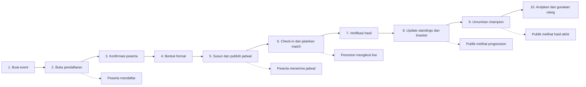
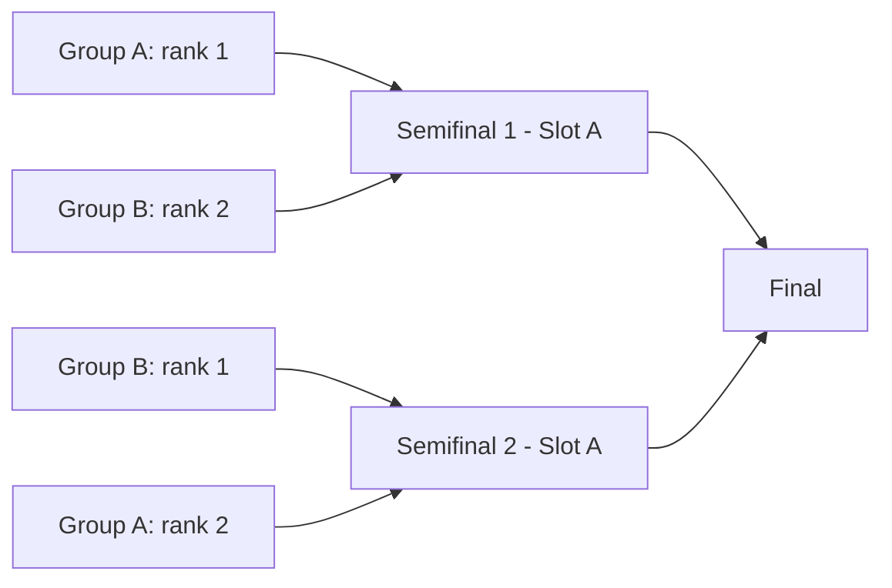
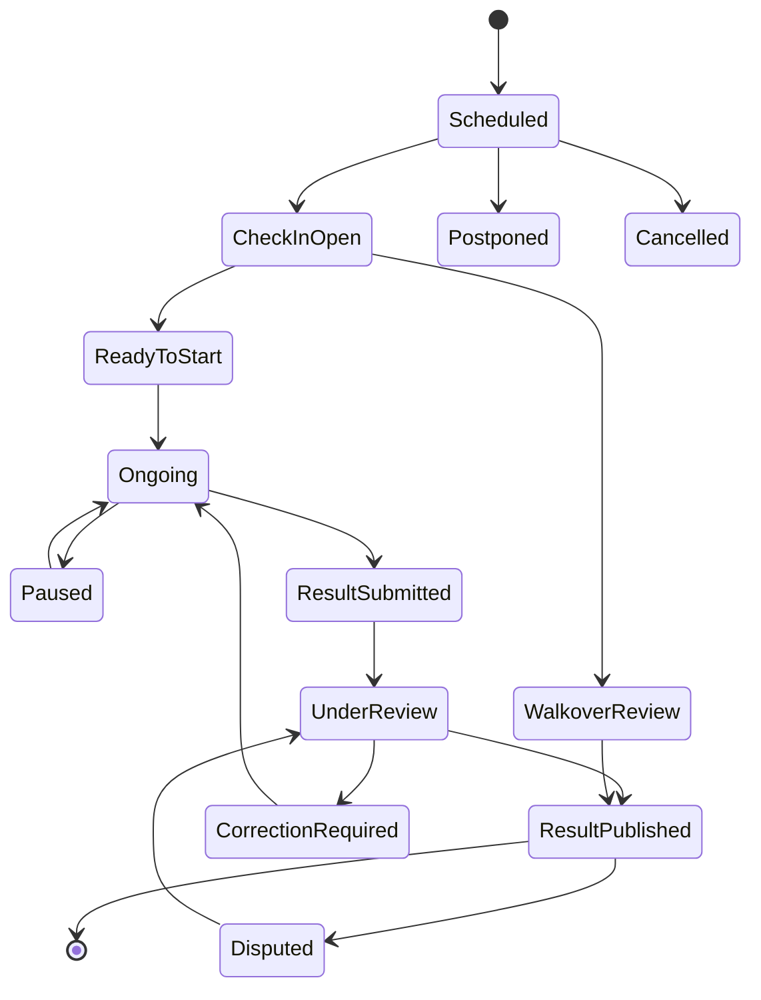
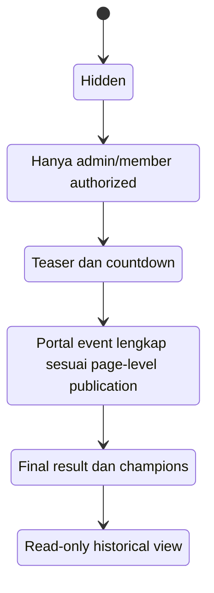

# Blueprint Product Flow ROC GMS V2

## Pengalaman Peserta, Penonton, dan Pengelola Turnamen dari Hulu ke Hilir

Status dokumen: rancangan produk  
Tanggal: 2 Agustus 2026  
Tujuan: menjadikan ROC GMS V2 lebih mudah dipahami, lebih mudah dioperasikan, dan lebih menarik untuk digunakan maupun dipresentasikan.

---

## 1. Visi pengalaman produk

ROC GMS V2 sebaiknya tidak terasa seperti kumpulan form admin, tabel database, dan halaman hasil yang berdiri sendiri. Produk harus terasa sebagai satu alur yang menyambung:

> Admin menyiapkan turnamen dengan percaya diri, peserta selalu tahu apa yang harus dilakukan berikutnya, dan penonton dapat mengikuti pertandingan tanpa perlu bertanya kepada panitia.

Janji produk yang mudah dijual:

> **Buat turnamen. Atur peserta dan jadwal. Jalankan pertandingan. Bagikan hasil secara langsung—semuanya dari satu tempat.**

Versi singkat untuk landing page:

> **From setup to champion, made simple.**

Tiga hasil yang harus dirasakan pengguna:

1. **Admin merasa dipandu.** Sistem selalu menunjukkan langkah berikutnya, masalah yang perlu diselesaikan, dan dampak setiap perubahan.
2. **Peserta merasa terlayani.** Jadwal, lokasi, lawan, check-in, hasil, dan perubahan tersedia dalam satu halaman personal.
3. **Penonton merasa dekat dengan pertandingan.** Live match, score, standings, bracket, update, dan champion mudah ditemukan tanpa login.

---

## 2. Siapa pengguna produk ini?

### 2.1 Public viewer: peserta

Peserta dapat berupa:

- pemain individual;
- anggota pair/doubles;
- anggota team;
- captain atau team manager;
- perwakilan club/departemen.

Pertanyaan utama peserta:

- Apakah saya sudah terdaftar?
- Saya bermain di kategori apa?
- Kapan dan di mana pertandingan saya?
- Siapa lawan saya?
- Apakah jadwal berubah?
- Apakah saya harus check-in?
- Berapa hasil pertandingan terakhir?
- Saya lolos ke tahap berikutnya atau tidak?
- Kapan pertandingan berikutnya?

### 2.2 Public viewer: penonton

Penonton tidak ingin mempelajari struktur administrasi. Mereka ingin:

- melihat pertandingan live sekarang;
- mencari team, pemain, sport, atau category;
- melihat pertandingan berikutnya;
- memahami standings dan bracket;
- melihat hasil, highlight, dokumentasi, dan champion;
- membagikan halaman yang menarik kepada orang lain.

### 2.3 Tournament admin: pengelola turnamen

Untuk pengguna, seluruh tim pengelola dapat terlihat sebagai satu area **Tournament Manager**. Di belakangnya, tanggung jawab tetap dibagi:

- **Tournament Owner / Super Admin**: pemilik event, user, integrasi, keamanan.
- **Event Admin**: konfigurasi event, sport, category, format, peserta.
- **Scheduler**: venue, court, jadwal, conflict, publikasi jadwal.
- **Match Officer / Referee**: check-in, lifecycle match, score, dokumentasi.
- **Content Admin**: announcement, article, highlight, komunikasi publik.

Pertanyaan utama admin:

- Apa yang harus saya kerjakan sekarang?
- Apakah turnamen sudah siap dipublikasikan?
- Apakah ada peserta, bracket, atau jadwal yang bermasalah?
- Apa yang sedang berlangsung hari ini?
- Pertandingan mana yang terlambat atau butuh tindakan?
- Apakah hasil sudah valid dan standings sudah diperbarui?
- Apa yang dilihat peserta dan penonton saat ini?

---

## 3. Prinsip desain flow

### 3.1 Satu aksi admin harus memiliki dampak publik yang jelas

Setiap form admin perlu menjawab:

- Apa yang berubah?
- Siapa yang dapat melihat perubahan ini?
- Apakah perubahan langsung tayang atau masih draft?
- Apakah notifikasi akan dikirim?
- Apakah perubahan dapat dibatalkan?

Contoh copy:

> Jadwal baru masih berupa draft. Peserta belum dapat melihatnya.

> Publish sekarang untuk memperbarui halaman publik dan mengirim notifikasi kepada 12 peserta terdampak.

### 3.2 Tampilkan pekerjaan, bukan struktur database

Hindari menjadikan menu utama sebagai daftar collection seperti `Competition Entries`, `Stages`, atau `Match Sets`.

Gunakan istilah yang berorientasi tugas:

| Istilah teknis | Label produk yang lebih mudah |
|---|---|
| Competition Entries | Peserta Kategori |
| Stages | Tahapan Kompetisi |
| Match Sets | Detail Score |
| Documentation Assets | Foto & Dokumen Pertandingan |
| Site Config | Pengaturan Platform |
| Generation | Buat Pertandingan |
| Result Published | Hasil Resmi |

### 3.3 Progressive disclosure

Pengguna baru melihat flow sederhana. Pengguna mahir dapat membuka advanced settings.

Contoh:

- Default: pilih template “Group lalu Knockout”.
- Advanced: atur jumlah group, qualifier, tiebreaker, source slot, consolation bracket.

### 3.4 Selalu ada “langkah berikutnya”

Setiap layar utama memiliki satu primary CTA, bukan lima tombol yang sama kuat.

Contoh:

- Setelah membuat event: **Tambahkan kategori**.
- Setelah peserta lengkap: **Buat format kompetisi**.
- Setelah match dibuat: **Susun jadwal**.
- Setelah jadwal bebas conflict: **Preview dan publish**.

### 3.5 Status harus berbicara dalam bahasa manusia

Jangan hanya menampilkan `ready_for_scheduling` atau `under_review`.

Gunakan status dan penjelasan:

- **Belum dijadwalkan** — Pilih waktu dan lapangan.
- **Siap dimainkan** — Peserta sudah check-in.
- **Menunggu verifikasi** — Officer telah mengirim hasil; admin perlu menyetujui.
- **Hasil resmi** — Standings dan bracket sudah diperbarui.

### 3.6 Jangan membuat publik menebak

Jika data belum tersedia, berikan penjelasan dan ekspektasi.

Buruk:

> No data.

Lebih baik:

> Jadwal belum dipublikasikan. Panitia akan mengumumkannya paling lambat 12 Agustus 2026.

---

## 4. Lifecycle bersama: admin dan publik



Sistem harus memperlakukan lifecycle ini sebagai kontrak. Publik hanya melihat state yang memang sudah siap dilihat; admin selalu melihat draft, warning, dan langkah perbaikannya.

---

## 5. Struktur navigasi yang disarankan

## 5.1 Navigasi publik berubah mengikuti fase event

### Sebelum event

- Beranda
- Cabang & Kategori
- Peserta
- Jadwal
- Pengumuman
- Info Event

Primary CTA peserta: **Daftar / Lihat status pendaftaran**  
Primary CTA penonton: **Ikuti event**

### Saat event berlangsung

- **Live**
- Jadwal
- Cari Peserta
- Standings
- Bracket
- Updates
- Info

Primary CTA peserta: **Jadwal Saya**  
Primary CTA penonton: **Lihat pertandingan live**

### Setelah event

- Hasil
- Champions
- Standings
- Bracket
- Highlights
- Gallery
- Info

Primary CTA: **Lihat seluruh pemenang**

## 5.2 Navigasi admin berorientasi fase

- **Overview**
- **Setup Event**
- **Peserta**
- **Format Kompetisi**
- **Jadwal**
- **Match Day**
- **Publish & Komunikasi**
- **Hasil & Laporan**
- **Pengaturan**

Submenu teknis hanya muncul jika relevan.

Contoh:

```text
Setup Event
  Detail Event
  Cabang & Kategori
  Venue & Lapangan
  Tampilan Publik

Peserta
  Pendaftaran Masuk
  Clubs & Teams
  Players & Rosters
  Peserta per Kategori

Format Kompetisi
  Format Builder
  Rules & Scoring
  Seeding & Draw

Jadwal
  Planner
  Belum Dijadwalkan
  Conflicts
  Publish History

Match Day
  Command Center
  Check-in
  Live Matches
  Hasil Menunggu Verifikasi
```

---

## 6. Flow admin dari hulu ke hilir

## 6.1 Tahap A — Sign in dan first-time onboarding

### Tujuan pengguna

Admin ingin segera membuat turnamen tanpa harus memahami seluruh sistem.

### Layar

**Welcome to InTourney / ROC GMS**

Isi layar:

- headline manfaat;
- tombol **Buat turnamen baru**;
- tombol sekunder **Buka turnamen yang sudah ada**;
- daftar template terakhir;
- bantuan singkat “Butuh waktu sekitar 5 menit untuk membuat draft pertama.”

### Jika admin baru

Tanyakan maksimal tiga hal:

1. Nama organisasi/panitia.
2. Zona waktu.
3. Bahasa utama.

Jangan meminta konfigurasi teknis di awal.

### Output

- profil organisasi dibuat;
- timezone dan bahasa menjadi default;
- admin diarahkan ke Create Event.

---

## 6.2 Tahap B — Create Event dalam mode cepat

### Tujuan pengguna

Mendapatkan event draft dan public preview secepat mungkin.

### Step 1 — Pilih jenis event

Kartu pilihan:

- **Turnamen satu hari**
- **Turnamen beberapa hari**
- **Liga / kompetisi berkala**
- **Office multi-sport games**
- **Mulai dari event sebelumnya**

Untuk ROC, pilihan recommended:

> **Office multi-sport games** — cocok untuk banyak cabang, kategori, club/departemen, dan venue.

### Step 2 — Informasi dasar

Input minimum:

- nama event;
- tanggal mulai dan selesai;
- lokasi utama;
- organizer;
- timezone.

Slug/public URL dibuat otomatis tetapi dapat diedit.

Preview langsung:

```text
Public URL
intourney.local/events/roc-olympic-2026
```

### Step 3 — Branding cepat

- logo;
- warna/preset;
- banner optional.

Berikan preset agar upload bukan blocker:

- Emerald Sport;
- Bold Orange;
- Corporate Blue;
- Minimal Monochrome.

### Step 4 — Selesai

Tampilkan hasil:

> Draft event berhasil dibuat.

Primary CTA: **Mulai setup event**  
Secondary CTA: **Lihat preview publik**

### Sistem di belakang layar

- membuat event draft;
- membuat default public page;
- membuat default visibility hidden;
- menyimpan actor dan audit event;
- tidak mempublikasikan apa pun.

---

## 6.3 Tahap C — Setup Dashboard

Setup tidak boleh terasa sebagai sidebar penuh halaman kosong. Gunakan checklist visual.

### Layar: Event Setup

```text
ROC Olympic 2026
Setup progress: 35%

[✓] Detail event
[✓] Tampilan dan branding
[ ] Cabang & kategori             0 kategori
[ ] Venue & lapangan              0 lapangan
[ ] Rules & scoring               Belum lengkap
[ ] Peserta                       0 confirmed
[ ] Format kompetisi              Belum dibuat
[ ] Jadwal                        Belum dipublish
```

### Setiap item memiliki

- status;
- alasan belum siap;
- estimasi pekerjaan;
- satu CTA.

Contoh:

> **Cabang & kategori belum tersedia**  
> Tambahkan minimal satu kategori untuk menerima peserta.  
> **Tambah kategori**

### Readiness score

Readiness tidak hanya persentase kosmetik. Ia dihitung dari invariant nyata:

- public information lengkap;
- minimal satu category published;
- category memiliki ruleset;
- participant minimum terpenuhi;
- format valid;
- match terbentuk;
- venue/court tersedia;
- tidak ada blocking conflict;
- schedule siap publish.

---

## 6.4 Tahap D — Menambah sport dan category

### Flow sederhana

1. Klik **Tambah cabang olahraga**.
2. Pilih dari katalog atau custom.
3. Tambahkan category.
4. Pilih participant mode.
5. Pilih format dan rules template.

### Contoh layar

```text
Cabang: Badminton

Kategori
  Men's Singles       Individual    Single Elimination
  Women's Singles     Individual    Single Elimination
  Mixed Doubles       Pair          Group + Knockout

[Tambah kategori]
```

### Form category yang mudah

Pertanyaan berurutan:

1. Siapa yang bertanding? Individual / Pair / Team / Club.
2. Bagaimana mereka bertanding? Group / Knockout / Group lalu Knockout / League.
3. Berapa jumlah pemain per entry?
4. Bagaimana cara menghitung score?

Advanced settings disembunyikan di bawah:

> Atur deuce, maximum score, point table, dan tiebreaker.

### Preview rules

Tampilkan ringkasan bahasa manusia:

> Best of 3 sets. Set dimenangkan pada 21 point, selisih 2, maksimal 30. Draw tidak diperbolehkan.

### Validasi langsung

- max roster tidak boleh kurang dari min roster;
- pair harus memiliki dua pemain aktif;
- best-of harus ganjil jika draw set tidak boleh;
- format unsupported tidak boleh dipilih;
- sport/category/rules harus berasal dari event yang sama.

### Output publik

Category masih draft sampai admin menekan **Publish category**.

---

## 6.5 Tahap E — Membuka pendaftaran

Flow ini penting agar produk terasa lengkap dan menjual.

### Admin memilih mode peserta

- **Panitia memasukkan peserta**
- **Peserta mendaftar sendiri**
- **Gabungan keduanya**

### Konfigurasi registration page

- tanggal buka/tutup;
- category yang dapat dipilih;
- capacity per category;
- waitlist;
- pertanyaan custom;
- kebutuhan roster;
- upload logo/photo optional;
- consent/rules acceptance;
- contact panitia;
- confirmation email;
- approval otomatis atau manual.

### Preview form

Admin dapat beralih:

- Desktop preview;
- Mobile preview;
- Participant preview.

### Publish registration

Confirmation modal:

```text
Buka pendaftaran?

Form akan dapat diakses publik mulai 5 Agustus 2026, 08:00.
Kuota total: 64 entry di 6 kategori.

[Kembali] [Buka pendaftaran]
```

### Output

- public page menampilkan CTA **Daftar sekarang**;
- QR/link registration tersedia;
- admin dashboard mulai menampilkan submission funnel.

---

## 6.6 Tahap F — Review dan konfirmasi peserta

### Admin inbox

Gunakan konsep inbox, bukan tabel mentah.

Tabs:

- Perlu ditinjau;
- Perlu dilengkapi;
- Confirmed;
- Waitlist;
- Withdrawn;
- Semua.

### Submission card

```text
IT Smash Pair
Badminton Mixed Doubles
Submitted 2 jam lalu

Roster: 2/2 lengkap
Email captain: verified
Rules accepted: yes

[Minta perbaikan] [Masukkan waitlist] [Konfirmasi]
```

### Bulk action

- approve selected;
- move category;
- assign seed;
- export;
- send reminder.

### Participant impact

Saat confirmed:

- participant menerima confirmation;
- participant mendapatkan magic link ke **My Tournament**;
- status public dapat ditampilkan sesuai privacy setting;
- entry tersedia untuk seeding/format.

### Data integrity

Sebelum confirm, sistem memastikan:

- source participant sesuai participant mode;
- roster size valid;
- player tidak melanggar eligibility;
- tidak ada duplicate entry;
- capacity tidak terlampaui;
- category masih menerima registration.

---

## 6.7 Tahap G — Format Builder

Ini harus menjadi salah satu fitur paling menjual.

### Pilihan awal

```text
Bagaimana kategori ini dimainkan?

[Group Stage]
[Single Elimination]
[Group lalu Knockout]  Recommended
[League]
[Custom]
```

### Template Group lalu Knockout

Pertanyaan:

1. Berapa peserta? Sistem sudah mengetahui jumlah confirmed entry.
2. Berapa group?
3. Berapa kali setiap lawan bertemu?
4. Berapa peserta lolos per group?
5. Apakah ada best third / wildcard?
6. Apakah ada bronze/classification match?

### Visual graph



Setiap slot menyimpan source eksplisit, bukan ditentukan dari nama round.

### Seeding

Pilihan:

- berdasarkan seed manual;
- random draw;
- serpentine antar-group;
- hindari same club pada opening round;
- upload/import seed.

### Draw experience

Admin dapat:

1. Preview draw.
2. Re-draw sebelum lock.
3. Lock draw.
4. Publish draw.

Setelah lock, perubahan harus memiliki reason dan impact preview.

### Format validation

Sebelum lanjut:

- semua participant ditempatkan tepat sekali;
- semua bye memiliki jalur valid;
- setiap winner/loser destination valid;
- tidak ada slot cycle;
- jumlah match sesuai format;
- qualifier source tidak ambigu;
- ruleset tersedia per phase.

Primary CTA: **Buat pertandingan**

---

## 6.8 Tahap H — Schedule Planner

### Tujuan pengguna

Mengubah daftar match menjadi jadwal valid tanpa spreadsheet.

### Layout desktop

```text
┌──────────────────┬─────────────────────────────────────────────┐
│ Belum dijadwalkan│ Timeline / Calendar                         │
│                  │ Court 1 | Court 2 | Futsal | Table 1        │
│ Quarterfinal 1   │ 08:00   | Match A | Match B |               │
│ Quarterfinal 2   │ 08:30   | Match C |         | Match D       │
│ ...              │                                             │
└──────────────────┴─────────────────────────────────────────────┘
```

### Flow

1. Admin mengatur match duration dan buffer per category.
2. Admin mengatur jam aktif setiap court.
3. Admin memilih **Susun otomatis** atau drag-and-drop manual.
4. Sistem membuat draft schedule.
5. Conflict panel menunjukkan blocking issue dan warning.
6. Admin memperbaiki atau menerima exception dengan reason.
7. Admin preview sebagai peserta.
8. Admin publish.

### Auto-plan options

- day/location;
- sport/category/phase;
- available court;
- minimum rest time;
- same club/player conflict;
- referee availability;
- priority final;
- lunch/prayer/ceremony break;
- travel time antar-venue.

### Conflict language

Buruk:

> participant_overlap

Lebih baik:

> **Budi bermain di dua pertandingan yang beririsan.**  
> Badminton QF-01 berakhir 10:30, sedangkan Table Tennis SF-02 dimulai 10:20.  
> Minimum waktu istirahat Budi adalah 20 menit.  
> **Pindahkan pertandingan**

### Draft dan publish

Schedule memiliki version:

- Draft v1;
- Published v1;
- Draft change v2;
- Published v2.

Perubahan setelah publish menghasilkan impact:

```text
3 pertandingan berubah
8 peserta terdampak
2 referee terdampak

[Preview perubahan] [Publish & notify]
```

---

## 6.9 Tahap I — Publish Center

Admin perlu satu tempat untuk memahami apa yang publik lihat.

### Sections

- Public website status;
- Registration status;
- Participant list visibility;
- Schedule version;
- Standings/bracket visibility;
- Announcement banners;
- Share link dan QR;
- Notification history.

### Preview mode yang benar

Admin dapat preview tanpa membuat event publik.

Banner preview:

> Preview mode — hanya pengelola event yang dapat melihat halaman ini.

### Publish checklist

```text
Ready to publish: 92%

[✓] Informasi event lengkap
[✓] 64 peserta confirmed
[✓] Format valid
[✓] 96 pertandingan dibuat
[✓] Semua pertandingan memiliki waktu dan venue
[!] 2 warning non-blocking

[Preview website] [Publish event]
```

### Confirmation

Admin memilih:

- publish sekarang;
- schedule publication;
- publish tanpa notification;
- publish dan notify participant.

---

## 6.10 Tahap J — Match Day Command Center

Ini adalah homepage admin selama event berlangsung.

### Ringkasan atas

```text
Saturday, 15 August

Live now: 4
Starting in 15 min: 7
Delayed: 2
Awaiting result: 3
Disputed: 1
Documentation missing: 5
```

### Sections

- Needs attention;
- Live matches;
- Next 60 minutes;
- Venue status;
- Result review queue;
- urgent announcement composer.

### Needs attention examples

```text
Match BD-QF-02 terlambat 18 menit
Kedua peserta sudah check-in, Court 2 tersedia.
[Mulai match] [Pindahkan court]
```

```text
Result FUT-GA-04 diperdebatkan
Team A mengirim 3–1, Team B mengirim 2–1.
[Review submissions]
```

### Role-specific view

- Event admin melihat seluruh event.
- Scheduler melihat issue waktu/venue.
- Match officer hanya melihat match yang ditugaskan.
- Content admin melihat update yang layak diumumkan.

---

## 6.11 Tahap K — Check-in

### Peserta

Peserta dapat check-in melalui:

- My Tournament;
- QR pada venue;
- captain check-in seluruh team;
- petugas check-in manual.

### Officer

Officer melihat:

```text
Match BD-QF-02 · 10:30 · Court 2

Andi Pratama         Checked in 10:12
Budi Santoso         Not checked in

[Check in Budi] [Mark absent] [Contact captain]
```

### State

- check-in not open;
- check-in open;
- one side ready;
- both sides ready;
- absent/no-show;
- ready to start.

### Automation

- reminder H-30;
- check-in opens H-20;
- warning H-5;
- no-show suggestion setelah grace period;
- walkover tetap membutuhkan confirmation officer/admin.

---

## 6.12 Tahap L — Menjalankan pertandingan dan live score

### Officer entry

Officer membuka magic link atau login lalu melihat **My Assigned Matches**.

Card menunjukkan:

- participant;
- waktu dan court;
- check-in;
- status;
- primary action.

### Live score screen

Struktur:

```text
Badminton Men's Singles · Quarterfinal
Andi Pratama vs Budi Santoso

Set 1              18 — 17

[Andi +1]          [Budi +1]

Serve: Andi        Target 21 · Win by 2 · Max 30

[Undo last action] [Pause] [Match notes]
```

### Prinsip scorekeeping

- tombol mengirim command increment, bukan absolute score;
- setiap command memiliki idempotency key;
- action history tersimpan;
- genuine undo membalik action terakhir;
- UI menampilkan sync state;
- ruleset menentukan apakah set selesai;
- officer tidak memilih winner yang bertentangan dengan score;
- offline action diantrikan bila PWA/offline diaktifkan.

### Match lifecycle



### Public impact

Setelah command score tersimpan:

- public match detail diperbarui;
- homepage live card diperbarui;
- follower menerima update sesuai preference;
- standings/bracket belum berubah sampai result official.

---

## 6.13 Tahap M — Submit dan verifikasi hasil

### Officer selesai

Officer menekan **Selesaikan pertandingan**.

Review sheet:

```text
Final score
Andi Pratama 2–1 Budi Santoso

Set 1 21–17
Set 2 18–21
Set 3 21–15

Winner: Andi Pratama
Rules validation: Passed
Documentation: 2 files attached

[Kembali ke score] [Submit hasil]
```

### Hasil masuk review queue

Admin melihat:

- score dan winner;
- officer;
- timestamps;
- action history;
- notes;
- participant confirmation/dispute;
- documentation.

### Approval

Saat admin menekan **Jadikan hasil resmi**, sistem menjalankan satu transaction/domain command:

1. Mengunci final result.
2. Membuat audit.
3. Membuat outbox event.
4. Memperbarui standings projection.
5. Memajukan winner/loser ke destination slot.
6. Menentukan match berikutnya bila participant lengkap.
7. Mengirim notification.
8. Memperbarui public feed.

### Success feedback

> Hasil resmi dipublikasikan. Andi maju ke semifinal BD-SF-01 pukul 14:00 di Court 1.

Primary CTA: **Lihat match berikutnya**

---

## 6.14 Tahap N — Standings dan bracket progression

### Admin

Admin melihat projection health:

```text
Standings updated 8 seconds ago · Source version 42
Bracket updated 8 seconds ago · Source version 42
All projections healthy
```

Jika gagal:

> Public standings masih menggunakan version sebelumnya. Sistem sedang mencoba kembali.  
> **View error** · **Retry now**

### Public

Public melihat:

- highlight rank movement;
- qualifier badge;
- next opponent;
- bracket path;
- last updated.

Contoh:

> IT Futsal naik ke posisi 1 setelah kemenangan 3–1.

> Finance lolos sebagai runner-up Group A dan akan menghadapi juara Group B.

---

## 6.15 Tahap O — Menutup event

### Close Event Assistant

Checklist:

- semua match memiliki final state;
- dispute selesai;
- standings final;
- champion semua category tersedia;
- documentation minimum lengkap;
- winner announcement siap;
- export/backup dibuat.

### Generate closing package

- final standings PDF;
- bracket PDF;
- list champions;
- match results Excel;
- documentation archive;
- event summary;
- audit/change export.

### Public transformation

Homepage berubah dari live command view menjadi celebration/archive view:

- champions;
- final standings;
- memorable results;
- articles/highlights;
- gallery;
- downloadable results.

### Reuse

Admin dapat menekan:

> **Gunakan sebagai template untuk event berikutnya**

Yang dicopy:

- sport/category;
- ruleset;
- venue/court;
- format template;
- branding optional.

Yang tidak dicopy otomatis:

- participant;
- schedule;
- score/result;
- private documentation.

---

## 7. Flow public viewer: peserta

## 7.1 Peserta menemukan event

Entry points:

- link WhatsApp/Teams/email;
- QR poster;
- event directory;
- direct link dari captain/panitia.

Landing harus langsung menjawab:

- event apa;
- kapan dan di mana;
- registration status;
- kategori;
- siapa organizer;
- CTA utama.

### Sebelum public open

```text
ROC Olympic 2026
Competition starts in 12 days

Informasi lengkap akan dibuka pada 10 Agustus 2026.
[Tambahkan pengingat]
```

### Registration open

```text
Registration is open
12 days remaining · 48/64 spots filled

[Daftar sekarang]
```

---

## 7.2 Peserta mendaftar

### Langkah form

1. Pilih category.
2. Masukkan participant/team identity.
3. Isi roster bila perlu.
4. Isi contact.
5. Setujui rules/consent.
6. Review.
7. Submit.

Progress:

> Step 2 of 5 · Team details

### Setelah submit

Jangan hanya menampilkan “success”.

```text
Pendaftaran berhasil dikirim

IT Smash Pair · Badminton Mixed Doubles
Status: Menunggu verifikasi panitia
Reference: REG-2026-0048

Kami mengirim link status ke captain@roc.local.

[Lihat status pendaftaran]
```

### Jika perlu perbaikan

Peserta menerima pesan spesifik:

> Roster Anda baru berisi 1 dari 2 pemain. Lengkapi sebelum 8 Agustus, 17:00.

CTA: **Lengkapi roster**

---

## 7.3 My Tournament

Peserta menggunakan magic link atau login ringan.

### Dashboard sebelum jadwal publish

```text
Hello, IT Smash Pair

Registration: Confirmed
Category: Badminton Mixed Doubles
Seed: Pending draw
Schedule: Will be published 12 August

[View category rules] [Manage roster]
```

### Setelah jadwal publish

```text
Your next match
Saturday · 09:30 · Court 2
vs Marketing Mix Pair

Check-in opens at 09:10

[Add to calendar] [Open directions] [Share]
```

Sections:

- Next match;
- All my matches;
- Team/roster;
- Category standing/bracket;
- Notifications;
- Contact organizer.

### Perubahan jadwal

Tampilkan old vs new:

```text
Schedule changed

BD-MD-03
Before: 09:30 · Court 2
Now:    10:00 · Court 1
Reason: Court maintenance

[Acknowledge] [Add updated calendar]
```

---

## 7.4 Match day peserta

Mobile homepage menjadi actionable:

```text
Good morning, Andi

Next match in 42 minutes
Badminton QF-02 · Court 2

Check-in is open
[Check in now]
```

Setelah check-in:

> Anda sudah check-in. Datang ke Court 2 paling lambat 10:20.

Saat match berjalan:

- current score;
- set/period;
- opponent;
- elapsed/status;
- official note.

Setelah match:

```text
Result submitted
You won 2–1

Waiting for official verification.
Your next match will appear after the result is approved.
```

Setelah official:

> Result official. Anda maju ke semifinal pukul 14:00.

---

## 7.5 Peserta mengajukan dispute

Jika delegated confirmation digunakan:

- dispute hanya untuk match yang diikuti;
- tersedia dalam window tertentu;
- reason wajib;
- evidence optional;
- original result tetap terlihat dengan badge under review;
- admin menjadi final decision maker.

```text
Apakah hasil ini tidak sesuai?

Official submission: 21–17, 18–21, 21–15
[Ajukan koreksi]
```

---

## 8. Flow public viewer: penonton

## 8.1 Penonton membuka event

Penonton tidak perlu login.

Hero pada event live:

```text
ROC Olympic 2026 · Live now

4 pertandingan sedang berlangsung
Next final starts at 15:00

[Lihat live matches] [Cari team atau pemain]
```

Urutan homepage:

1. Live now.
2. Starting soon.
3. Urgent updates.
4. Search participant/team.
5. Featured standings/bracket.
6. Latest results.
7. Highlights/articles.

## 8.2 Search yang universal

Satu search field:

> Cari team, pemain, cabang, kategori, atau nomor pertandingan

Hasil dikelompokkan:

```text
Teams
  IT Futsal Squad

Players
  Andi Pratama

Matches
  IT Futsal vs Finance · Live 2–1
```

## 8.3 Live match detail

Above the fold:

- participant/team;
- score besar;
- live status;
- set/period/time;
- venue;
- last update.

Di bawah:

- set breakdown atau event timeline;
- bracket/standing impact;
- next match path;
- official updates;
- public photos;
- share/follow.

### Realtime state

```text
Live · Updated 3 seconds ago
```

Jika koneksi terputus:

> Live update paused. Trying to reconnect…

## 8.4 Follow team/player

Tanpa memaksa account penuh:

- follow via browser preference;
- add calendar;
- email/web push optional;
- share shortcut.

Preference:

- match reminder;
- match started;
- result official;
- next-round qualification;
- schedule changes.

## 8.5 Setelah event

Penonton langsung melihat celebration:

```text
Tournament completed

18 categories · 96 matches · 312 participants

[Meet the champions]
```

Champion cards memiliki:

- sport/category;
- winner;
- club;
- final result;
- photo/highlight;
- share.

---

## 9. Handoff admin ke publik

| Aksi admin | Validasi sistem | Perubahan publik | Notifikasi | Audit |
|---|---|---|---|---|
| Membuka registration | Window, capacity, form valid | CTA Daftar muncul | Optional launch message | Registration published |
| Mengonfirmasi entry | Roster, duplicate, eligibility | Participant tampil sesuai privacy | Confirmation ke captain | Entry confirmed |
| Lock draw | Semua entry ditempatkan tepat sekali | Bracket preview siap | Belum dikirim | Draw locked |
| Publish draw | Format graph valid | Bracket tayang | Participant mendapat opponent/path | Draw published |
| Publish schedule | Tidak ada blocking conflict | Jadwal dan My Schedule tayang | Affected participant/referee | Schedule version published |
| Reschedule | Lifecycle dan conflict valid | Waktu/venue berubah | Hanya pihak terdampak | Before/after + reason |
| Start match | Check-in/override valid | Badge Live muncul | Follower optional | Match started |
| Record point | Ruleset dan version valid | Score live berubah | Biasanya tidak per-point | Score command |
| Submit result | Score completeness valid | Badge menunggu verifikasi | Admin review queue | Result submitted |
| Approve result | Winner/rules/transaction valid | Result, standing, bracket berubah | Participant/follower | Result published + projection version |
| Publish announcement | Audience/window valid | Banner/feed muncul | Targeted notification | Announcement published |
| Close event | Semua blocking item selesai | Celebration/archive mode | Closing announcement | Event completed |

---

## 10. State publik yang harus konsisten

## 10.1 Event visibility



`status` operasional dan `visibility` publik tidak boleh membentuk kombinasi sembarang. Gunakan policy yang menghasilkan public mode dari lifecycle dan timestamps.

## 10.2 Match publication

Pisahkan:

- operational status;
- schedule visibility;
- score visibility;
- result official status.

Contoh:

| Operational status | Publik melihat |
|---|---|
| Draft | Tidak terlihat |
| Scheduled, schedule draft | Tidak terlihat |
| Scheduled, schedule published | Waktu, venue, participant |
| Ongoing | Live score |
| Result submitted | Unofficial result / under review badge |
| Result published | Official result + standings/bracket impact |
| Disputed | Under review; official history tidak diam-diam dihapus |

---

## 11. Notification design

## 11.1 Prinsip

- hanya kirim informasi yang actionable;
- target berdasarkan dampak;
- hindari spam score per point;
- link selalu menuju konteks yang benar;
- simpan delivery status;
- participant dapat mengatur preference.

## 11.2 Trigger inti

### Participant

- registration received;
- registration confirmed/requires change/waitlisted;
- draw published;
- schedule published;
- schedule changed;
- check-in open;
- match reminder;
- result official;
- qualified/next match ready;
- dispute resolved.

### Admin

- registration needs review;
- format invalid setelah participant withdrawal;
- blocking schedule conflict;
- match delayed;
- result awaiting review;
- dispute submitted;
- projection failed;
- documentation missing;
- event ready to close.

## 11.3 Channel

Urutan MVP:

1. In-app notification center.
2. Email.
3. Microsoft Teams/WhatsApp share template.
4. Web push.
5. Native push bila ada app.

---

## 12. Empty, loading, error, dan permission states

Flow mudah dipahami bukan hanya ketika data sempurna.

## 12.1 Empty state harus mengajar

Admin schedule kosong:

> Belum ada pertandingan untuk dijadwalkan. Buat format kompetisi dan generate match terlebih dahulu.  
> **Buka Format Builder**

Public standings kosong:

> Standings akan muncul setelah hasil pertama menjadi resmi.

## 12.2 Error harus actionable

Buruk:

> Invalid relationship.

Lebih baik:

> Court 2 tidak tersedia untuk Badminton. Pilih court lain atau ubah sport yang didukung Court 2.

## 12.3 Unsaved dan concurrent change

Jika dua admin membuka data sama:

> Jadwal ini telah diperbarui Dani pada 10:42. Review perubahan terbaru sebelum menyimpan.

Pilihan:

- reload latest;
- compare changes;
- cancel.

## 12.4 Unauthorized

Jangan hanya mengatakan access denied.

> Anda memiliki akses Match Officer. Pengaturan jadwal hanya dapat diubah oleh Scheduler atau Event Admin.  
> **Kembali ke Assigned Matches**

---

## 13. Dashboard yang adaptif terhadap fase

Admin tidak membutuhkan dashboard statis.

### Fase setup

- readiness checklist;
- registration count;
- missing rules/venues;
- next recommended action.

### Fase scheduling

- unscheduled match;
- conflicts;
- participant without match;
- publish readiness.

### Fase live

- live/delayed/upcoming;
- disputes;
- review queue;
- urgent message;
- projection health.

### Fase completed

- unresolved match;
- champions completeness;
- documentation completeness;
- closing package;
- archive/reuse.

Public homepage juga berubah dengan lifecycle yang sama.

---

## 14. Momen yang membuat produk “menjual”

## 14.1 Event draft dalam tiga menit

Setelah nama, tanggal, dan template dipilih, admin langsung melihat preview event yang terlihat profesional.

## 14.2 Readiness checklist

Admin tidak perlu mengingat seluruh langkah. Sistem mengatakan apa yang kurang dan memberi tombol perbaikan.

## 14.3 Visual format builder

Admin dapat melihat hubungan group, qualifier, semifinal, dan final sebelum satu match pun dimainkan.

## 14.4 One-click schedule planning

Sistem menghasilkan draft schedule dengan conflict explanation yang mudah dipahami.

## 14.5 Publish impact preview

Sebelum mengubah jadwal publik, admin tahu siapa yang terdampak dan notification apa yang dikirim.

## 14.6 Match-day command center

Satu layar menunjukkan apa yang live, terlambat, menunggu hasil, atau bermasalah.

## 14.7 Hasil resmi menggerakkan semuanya

Sekali admin approve result:

- score resmi;
- standings update;
- bracket update;
- participant maju;
- next match tersedia;
- notification terkirim.

## 14.8 Closing package otomatis

Admin mengakhiri event dengan champion page, export, gallery, dan template event berikutnya.

---

## 15. MVP flow yang disarankan

Jangan membangun seluruh blueprint sekaligus. MVP harus menyelesaikan satu vertical slice secara benar.

## MVP 1 — Turnamen yang dapat dijalankan dengan aman

### Admin

- create event guided flow;
- setup checklist;
- sport/category/rules yang benar-benar didukung;
- manual participant + import aman;
- single elimination dan round robin benar;
- scheduler manual dengan conflict yang benar;
- match assignment;
- check-in sederhana;
- concurrency-safe score;
- result approval;
- transactional standings/bracket update;
- publish center.

### Public

- coming soon/published/archive yang benar;
- event overview;
- schedule;
- search participant;
- match detail live polling;
- standings/bracket;
- champion;
- share dan ICS.

## MVP 2 — Mengurangi pekerjaan panitia

- self-registration;
- approval/waitlist;
- email confirmation/reminder;
- schedule version + publish impact;
- auto planner dasar;
- PDF/Excel export;
- My Tournament participant page.

## MVP 3 — Menyamai pengalaman platform matang

- group-to-knockout graph;
- referee scheduling;
- delegated score link;
- dispute flow;
- advanced tiebreaker;
- player statistics;
- realtime SSE/WebSocket;
- TV/slideshow;
- sponsor dan notification channels.

---

## 16. Acceptance criteria pengalaman

## 16.1 Admin baru

- Dapat membuat event draft dan membuka preview dalam kurang dari 5 menit.
- Selalu dapat menyebutkan langkah berikutnya tanpa membaca manual.
- Tidak dapat mempublikasikan configuration yang invalid.
- Dapat memahami dampak perubahan schedule sebelum publish.

## 16.2 Scheduler

- Dapat melihat seluruh unscheduled match tanpa hard cap tersembunyi.
- Conflict menjelaskan siapa/apa/waktu yang bermasalah.
- Tidak ada jalur lain yang dapat mengubah schedule tanpa validation yang sama.
- Published schedule memiliki version dan change history.

## 16.3 Match officer

- Hanya melihat match yang ditugaskan.
- Dapat menjalankan score dengan satu tangan pada mobile.
- Double tap/two-device tidak kehilangan point.
- Tidak dapat menghasilkan final result yang melanggar ruleset.
- Dapat mengoreksi action terakhir dengan audit yang jelas.

## 16.4 Peserta

- Dapat menemukan next match dalam maksimal dua tap.
- Selalu tahu registration/check-in/result status.
- Mendapat perubahan jadwal dengan old/new value dan reason.
- Setelah lolos, next match muncul otomatis.

## 16.5 Penonton

- Dapat membuka live match tanpa login.
- Dapat mencari team/player/category dari satu search.
- Dapat memahami apakah score live, unofficial, atau official.
- Standings/bracket menampilkan last-updated dan tidak pernah diam-diam stale.

---

## 17. North-star metrics

### Admin efficiency

- median time create event -> first preview;
- median time confirmed participant -> valid format;
- persentase match auto-scheduled tanpa manual correction;
- jumlah schedule conflict setelah publish;
- median result submit -> official;
- jumlah manual data repair.

### Participant confidence

- persentase participant yang membuka My Schedule;
- check-in completion rate;
- schedule-change acknowledgement rate;
- pertanyaan jadwal ke panitia per 100 participant;
- dispute rate dan resolution time.

### Public engagement

- live page views;
- repeat visitors;
- follows/calendar subscriptions;
- share rate;
- average time to find a match;
- champion/highlight views setelah event.

### Reliability

- lost/duplicate score command: harus 0;
- stale standings/bracket duration;
- projection retry success;
- notification delivery rate;
- event with blocking data inconsistency: harus 0.

---

## 18. Rekomendasi copy utama

### Landing marketing

> **Run every match with confidence.**  
> Kelola peserta, format, jadwal, live score, standings, dan informasi event dari satu platform.

CTA: **Buat turnamen**  
Secondary: **Lihat contoh event**

### Admin empty workspace

> Turnamen Anda dimulai dari sini. Buat event pertama dan dapatkan public preview dalam beberapa menit.

CTA: **Buat event pertama**

### Publish readiness

> Hampir siap. Selesaikan 2 masalah sebelum jadwal dapat dipublikasikan.

CTA: **Review masalah**

### Public live

> Pertandingan sedang berlangsung. Ikuti score, standings, dan perjalanan menuju final secara langsung.

CTA: **Lihat live matches**

### Completed event

> Pertandingan selesai, cerita tetap hidup. Lihat champions, hasil akhir, dan highlight ROC Olympic 2026.

CTA: **Meet the champions**

---

## 19. Keputusan desain utama

1. Produk menggunakan lifecycle event sebagai tulang punggung pengalaman.
2. Admin dashboard dan public homepage bersifat phase-aware.
3. Setup menggunakan guided checklist; advanced tools tetap tersedia.
4. Public participant dan spectator berbagi portal, tetapi participant mendapat My Tournament yang personal.
5. Seluruh mutation penting melewati satu domain command layer.
6. Schedule dan public publication memiliki version.
7. Score disimpan sebagai action/event yang concurrency-safe.
8. Standings dan bracket adalah projection versioned, bukan write manual.
9. Format progression menggunakan graph eksplisit.
10. Setiap perubahan admin menjelaskan public impact dan notification impact.
11. Istilah produk berorientasi tugas dan manusia, bukan nama collection.
12. Flow MVP mengutamakan correctness sebelum format/fitur yang luas.

---

## 20. Gambaran akhir pengalaman ideal

### Dari sisi admin

Admin membuat event, mengikuti checklist, membuka pendaftaran, mengonfirmasi peserta, memilih template format, melihat draw secara visual, menyusun jadwal, menyelesaikan conflict, lalu mempublikasikan semuanya. Saat hari pertandingan, admin membuka Command Center dan hanya menangani exception. Officer mengelola match yang ditugaskan. Setelah hasil disetujui, standings, bracket, next match, public feed, dan notification bergerak otomatis. Setelah final, sistem membantu menutup dan mengarsipkan event.

### Dari sisi peserta

Peserta membuka satu link, mendaftar, menerima confirmation, dan selalu kembali ke My Tournament. Di sana tersedia next match, venue, check-in, opponent, rules, schedule change, result, dan next-round progression. Peserta tidak perlu mencari informasi di chat yang berbeda-beda.

### Dari sisi penonton

Penonton membuka link tanpa login dan langsung melihat apa yang live. Search membantu menemukan team atau pemain. Match detail memperlihatkan score dan konteks kompetisi. Standings dan bracket selalu mengikuti hasil resmi. Setelah event, portal berubah menjadi arsip yang merayakan champion dan cerita event.

Itulah flow yang membuat ROC GMS V2 bukan hanya “sistem input data turnamen”, tetapi sebuah produk yang menghubungkan panitia, peserta, dan penonton dari persiapan sampai perayaan juara.
